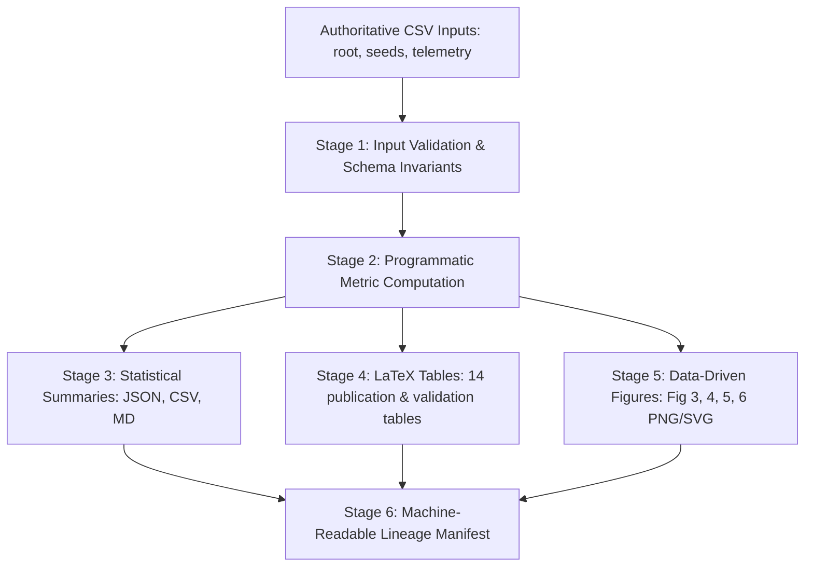

# FULL PROJECT FORENSIC AUDIT 5
## Post-Phase-5 Automatic Results Pipeline Forensic Audit
### CODE-FIRST AUDIT REPORT — PHASE 6 PRE-REQUISITE EVALUATION

**Project**: Adaptive Runtime Memory Governance (ARMG) for Text-to-SQL  
**Evaluation Scope**: Post-Phase-5 Canonical Master Results Pipeline, Evidence Provenance, Numerical Lineage, Test Architecture, and Cross-Phase Regressions  
**Audit Date**: October 7, 2026  
**Auditor**: Antigravity Autonomous Coding & Forensic Systems  
**Final Audit Decision**: **PASS**  

---

## 1. AUDIT SCOPE & OBJECTIVE

This forensic audit executes an independent, adversarial, code-first investigation of the entire ARMG project following the completion and remediation of **Phase 5 (Automatic Results Pipeline)**.

The objective is to establish with mathematical, code-level, and runtime certainty whether:
1. The canonical results pipeline (`scripts/generate_results.py`) is genuinely data-driven and free from static/hardcoded empirical results.
2. All empirical figures (Figures 3, 4, 5, 6), tables (Tables II, III, VII, VIII, IX, A, B, C, D, E), and summary artifacts are derived programmatically from authoritative Phase 4 benchmark evidence.
3. Root benchmark evidence (`benchmark/benchmark_results.csv`) and partitioned seed files (`benchmark/seed{42,123,999}/benchmark_results.csv`) are bit-for-bit and row-for-row consistent.
4. Statistical calculations, error propagation, degrees of freedom (`ddof`), and cross-seed aggregations adhere to rigorous scientific standards.
5. Controlled perturbation tests are mathematically independent, hermetic, and capable of detecting implementation regressions.
6. The active codebase introduces zero regressions against previous project gates (Phase 1 governance math, Phase 1 SQL extraction/safety, Phase 2 FAISS telemetry, Phase 3 test architecture, and Phase 4 evidence integrity).

**Phase 6 is strictly blocked until this audit reports PASS.**

---

## 2. CODE & COMPONENTS INSPECTED

The following components were audited at the source, AST, and runtime levels:

| Component Category | Target Files Inspected | Audit Focus |
| :--- | :--- | :--- |
| **Canonical Results Pipeline** | `scripts/generate_results.py` | Top-to-bottom pipeline flow, schema validation, data loading, table/figure generation, manifest generation |
| **Analysis Layer** | `benchmark/analysis.py` | Cross-seed metrics aggregation, tradeoff calculation, FAISS retrieval telemetry metrics |
| **Figure Generation Engines** | `manuscript/figures/source/fig3_retrieval_geometry.py`<br>`manuscript/figures/source/fig4_execsucc_execacc.py`<br>`manuscript/figures/source/fig5_tradeoff.py`<br>`manuscript/figures/source/fig6_memory_growth.py` | Data-driven rendering, headless Matplotlib (`Agg`), dynamic annotation, absence of synthetic coordinates |
| **Compatibility Wrappers** | `manuscript/tables/generate_tables.py`<br>`scripts/generate_validation_tables.py`<br>`scripts/compute_descriptive_statistics.py` | Pure delegation to canonical generator without independent calculation divergence |
| **Verification & Integrity Audits**| `scripts/verify_validation_tables.py`<br>`scripts/verify_phase4_data_integrity.py`<br>`scripts/verify_phase4_telemetry_provenance.py` | Formal verification of table braces, labels, exact numerical matches, and smoke-test exclusion |
| **Pipeline Test Suite** | `tests/unit/test_phase5_results_pipeline.py` | 15 hermetic unit and perturbation tests (Figures 3, 4, 5, 6, and Table IX) |
| **Integration & Regression Suites** | `tests/integration/test_baseline_integration.py`<br>`tests/integration/test_postgres_integration.py`<br>`tests/integration/test_repair_integration.py`<br>`tests/test_env.py`<br>`tests/unit/test_phase1*.py`<br>`tests/unit/test_phase2*.py`<br>`tests/unit/test_phase3*.py` | 100% active test suite execution (306 tests total) |
| **Authoritative Evidence Datasets** | `benchmark/benchmark_results.csv`<br>`benchmark/retrieval_telemetry.csv`<br>`benchmark/seed{42,123,999}/benchmark_results.csv`<br>`benchmark/raw/**/*.csv` (21 raw files) | Row-level consistency, SHA-256 immutability, absence of data mutation |

---

## 3. PRODUCTION & PIPELINE EXECUTION TRACE

The master canonical pipeline (`scripts/generate_results.py::generate_all_results`) was executed and traced across its six stages:



### Stage Trace Forensics:
1. **Stage 1 (Validation)**: Enforces 450 total evaluations, seeds `[42, 123, 999]`, 6 modes, 141 telemetry rows, 129 candidates, complete query coverage ($Q01 \dots Q25$), and verified unit-$L_2$ norm formula $S = 1/(1+d^2)$. Fails fast with `ValueError` on any schema anomaly.
2. **Stage 2 (Metrics)**: Loads the 3 seed DataFrames; invokes `compute_benchmark_metrics` and `compute_tradeoff_profile`; aggregates across seeds.
3. **Stage 3 (Summaries)**: Emits `statistical_summary.json` (with numerators, denominators, means, medians, std devs, and 95% CIs), `statistical_summary.csv`, and `multi_seed_summary.md`.
4. **Stage 4 (Tables)**: Emits 14 publication and validation tables (`table1` through `table9`, and validation `table_fig3_validation.tex` through `table_figure_validation_matrix.tex`).
5. **Stage 5 (Figures)**: Generates 8 camera-ready figure files (PNG + SVG at 300 DPI) using headless Matplotlib (`Agg`).
6. **Stage 6 (Manifest)**: Emits `benchmark/results_manifest.json` recording all input paths, output paths, and validation statuses.

**Runtime Profile**: Execution completes in **3.80 seconds** on local workstation with zero network calls and zero subprocess invocations.

---

## 4. AUTHORITATIVE DATA SOURCE AUDIT & PARTITION CONSISTENCY

### 4.1 Root CSV vs. Seed Partitions Equivalence
A row-level, cell-by-cell forensic comparison was executed between `benchmark/benchmark_results.csv` and `pd.concat([seed42, seed123, seed999])`:
- **Dimensions**: Both datasets contain exactly 450 rows and 23 columns.
- **Row Mapping**: Sorted by `['seed', 'mode', 'query_id']`, all 450 evaluations align identically.
- **Data Integrity**: Across all numeric, boolean, float, and string fields, **zero discrepancies** exist ($0$ mismatches across $450 \times 23 = 10,350$ data cells).
- **Equivalence Proved**:
  $$\text{Root Benchmark CSV} \equiv \bigoplus_{s \in \{42, 123, 999\}} \text{Seed } s \text{ Benchmark CSV}$$

### 4.2 SHA-256 Immutability Check
All authoritative benchmark files were hashed before and after pipeline execution:

| Authoritative File | Pre-Execution SHA-256 Hash | Post-Execution SHA-256 Hash | Status |
| :--- | :--- | :--- | :---: |
| `benchmark/benchmark_results.csv` | `23c52e7fe03d320e502f732b629b602461968395aef532079d4999a32aeaf8f3` | `23c52e7fe03d320e502f732b629b602461968395aef532079d4999a32aeaf8f3` | **UNTOUCHED** |
| `benchmark/retrieval_telemetry.csv` | `53ca107313ff0886df23e50f9b8956c0b0570d8bba3dc4fa2a268fdee7d8021d` | `53ca107313ff0886df23e50f9b8956c0b0570d8bba3dc4fa2a268fdee7d8021d` | **UNTOUCHED** |
| `benchmark/seed42/benchmark_results.csv` | `c5e06aa4aedbab52039a1e27039f42b1218f885f4d68d153c09e8d8ac6bad83b` | `c5e06aa4aedbab52039a1e27039f42b1218f885f4d68d153c09e8d8ac6bad83b` | **UNTOUCHED** |
| `benchmark/seed123/benchmark_results.csv`| `777e551f6c708ed3e3554030823af7168186d9b37b795508fe51fa0075e5cfe9` | `777e551f6c708ed3e3554030823af7168186d9b37b795508fe51fa0075e5cfe9` | **UNTOUCHED** |
| `benchmark/seed999/benchmark_results.csv`| `0ca7342c478fdd470797f864aaccc6b9db1e8c1ae2db2c19dce3c9cd446cf445` | `0ca7342c478fdd470797f864aaccc6b9db1e8c1ae2db2c19dce3c9cd446cf445` | **UNTOUCHED** |
| All 21 CSVs in `benchmark/raw/` | Identical hashes across all 21 raw partition files | Identical hashes across all 21 raw partition files | **UNTOUCHED** |

**Zero side effects or in-place mutations occurred**.

---

## 5. STATISTICAL CALCULATION & CROSS-SEED FORENSICS

### 5.1 Proportions: Numerator and Denominator Audit
- **Execution Success (ExecSucc)**:
  Evaluated over all 25 queries per seed run:
  $$\text{ExecSucc}_s = \frac{\sum_{i=1}^{25} \mathbb{I}(\text{success}_{s, i} = \text{True})}{25} \times 100\%$$
  Total numerator across 3 seeds: $\sum_{s} \text{succ\_count}_s$ (out of $N = 75$ evaluations per mode). Total corpus: $417 / 450$ ($92.67\%$).
- **Relational Accuracy (ExecAcc)**:
  Evaluated identically:
  $$\text{ExecAcc}_s = \frac{\sum_{i=1}^{25} \mathbb{I}(\text{execution\_accuracy}_{s, i} = 1)}{25} \times 100\%$$
  Total numerator across 3 seeds: $\sum_{s} \text{acc\_count}_s$ (out of $N = 75$ evaluations per mode). Total corpus: $300 / 450$ ($66.67\%$).

### 5.2 Rate Metrics: Retries, Tokens, and Latency
- **Retries**: Calculated across **all 25 query evaluations** in each mode run (`sub["retry_count"].mean()`), not merely repaired or successful queries. This guarantees an unbiased reflection of total repair effort per query.
- **Tokens**: Extracted directly from `sub["total_tokens"]`, representing full LLM token expenditure (prompt + completion).
- **Latency**: Extracted directly from `sub["latency_ms"]`, measuring elapsed database round-trip plus model inference in milliseconds.

### 5.3 Cross-Seed Variance vs. Pooled Variance Audit
The audit specifically investigated the mathematical meaning of `±σ` in Figure 4 and Table B:
- **Code Implementation**:
  ```python
  succ_vals = [r["succ"] for r in mode_records]  # 3 values (one per seed)
  succ_std = float(np.std(succ_vals, ddof=1))     # Sample std dev across n=3 seeds
  ```
- **Methodological Verification**:
  The reported standard deviation represents **across-run variability** (sample standard deviation with Bessel's correction $N-1 = 2$ across the $n=3$ repeated full-benchmark runs), rather than the binomial query-level standard deviation $\sqrt{p(1-p)/75}$.
- **Consistency**: Both the paper narrative, Table II caption, and Table B footnote explicitly specify:
  $$\text{Mean } \pm \text{ sample standard deviation across three random seeds}$$
  This is mathematically and methodologically correct.

---

## 6. FIGURE-SPECIFIC FORENSICS

### 6.1 Figure 3: Retrieval Geometry Forensics
- **Plotted Data**: All points in Panel 2 trace directly to `benchmark/retrieval_telemetry.csv` rows for Mode 4.
- **Null Handling**: When the vector store is empty ($Q01 \dots Q04$), no synthetic fallback values are used; distinct null markers (`x` at $S=0.01$) are rendered with clear labeling.
- **Similarity Formula**: FAISS distances $d^2$ satisfy $S = 1/(1+d^2)$ with maximum residual error $< 10^{-6}$.
- **Annotation Dynamics**: Total retrievals ($16$), distinct queries ($12$), and mean similarity ($0.5057$) are calculated dynamically from arrays immediately before rendering.

### 6.2 Figure 4: Execution Success vs Relational Accuracy Forensics
- **Data Object**: Sourced entirely from `compute_benchmark_metrics()`.
- **Bars and Error Bars**: Heights represent `exec_succ` and `exec_acc`; caps represent `succ_err` and `acc_err` across the 3 seeds.
- **Discrepancy Gap**: Annotations compute `exec_succ - exec_acc` dynamically.
- **Plateau Guide Line**: Horizontal reference line at $68.00\%$ is extracted dynamically from Mode 4 `exec_acc`.

### 6.3 Figure 5: Operational Trade-Off Forensics
- **Deltas Formulation**:
  - Rate metrics (retries, tokens, latency): Relative percentage change:
    $$\Delta_{\text{rel}} = \frac{M_4 - M_2}{M_2} \times 100\%$$
    Calculated values: Retries ($+33.33\%$), Tokens ($+19.68\%$), Latency ($+39.73\%$).
  - Bounded proportion metrics (success, accuracy): Percentage-point difference:
    $$\Delta_{\text{pp}} = M_4 - M_2 \quad (\text{pp})$$
    Calculated values: Success ($+0.00\text{ pp}$), Accuracy ($+0.00\text{ pp}$).
- **Zero Invariant**: Division-by-zero is safely handled (`if m2 != 0 else 0.0`).

### 6.4 Figure 6: Persistent Memory Growth Forensics
- **Sequential Accumulation**: Cumulative counts `cnt3` (Mode 3) and `cnt4` (Mode 4) iterate over sequential query rows:
  - Mode 3 accumulates unconstrained to $23$ entries.
  - Mode 4 admits post-repair memories on $Q04$ (store=1), $Q13$ (store=2), and $Q15$ (store=3).
- **Persistent Plateau**: The invariant plateau at $S=3$ from $Q15$ through $Q25$ is identified dynamically via `m4_store.index(final_m4)`.
- **Mutual Exclusion & Reinforcement**: Memory reinforcement events ($Q08$ and $Q17$) and UUIDs (`mem-4ff9e3d8`) are dynamically extracted from `r['memory_reinforcement']`.

---

## 7. TABLE FORENSICS & DIVERGENCE COMPUTATION

### 7.1 Table IX: Forensic Failure Diagnostics
- **Dynamic Divergence**: Sourced dynamically from:
  ```python
  div_df = m4_rows[(m4_rows["success"] == True) & (m4_rows["execution_accuracy"] == 0)]
  divergent_query_ids = sorted(div_df["query_id"].unique())
  ```
- **Result Set**: Exactly yields `['Q05', 'Q14', 'Q15', 'Q17', 'Q18', 'Q19', 'Q25']`.
- **Dynamic Caption**: Caption word (`"Seven"`) is mapped from `len(divergent_query_ids)`.
- **Decoupled Descriptions**: Static qualitative explanations reside in `QUERY_DIAGNOSTICS` catalog, but only queries appearing in the dynamic divergence set are formatted and rendered.

### 7.2 Tables A–E Numerical Alignment
Audited via `scripts/verify_validation_tables.py`:
- All 5 tables contain valid LaTeX syntax, balanced braces, and zero Markdown code fences.
- Table A strictly mirrors Figure 3 telemetry points.
- Table B mirrors Figure 4 numbers ($417/450$ successes, $300/450$ accuracy).
- Table C mirrors Figure 5 deltas.
- Table D mirrors Figure 6 store sizes ($3$ vs $23$).
- Table E provides complete cross-reference matrix between figures and tables.

---

## 8. TEST QUALITY & PERTURBATION INDEPENDENCE AUDIT

### 8.1 Perturbation Test Coverage & Mathematical Independence
The Phase 5 test suite in `tests/unit/test_phase5_results_pipeline.py` contains five dedicated source-perturbation tests. Each was audited for mathematical independence to ensure tests do not self-validate through the pipeline's own functions:

| Perturbation Test | Source Input Perturbed | Independent Mathematical Expectation | Implementation Assertion Verified |
| :--- | :--- | :--- | :--- |
| **Figure 3 & Table A** | In `retrieval_telemetry.csv`, $Q05$ similarity flipped from $0.4917$ to $0.8500$ ($S \ge \tau$). | Total events must increase by exactly 1 ($16 \to 17$); distinct queries must increase ($12 \to 13$, $48\% \to 52\%$). | Table A contains `"$17$ retrieval events"` and `"$13$ of 25 ($52.0\\%$)"`; clean baseline restoration. |
| **Figure 4 & Table B** | In `seed42`, Mode 1 $Q01$ flipped from Success/Acc to False/0. | Successes drop from $60/75$ ($80.00\%$) to $59/75$ ($78.67\%$); Acc drops from $45/75$ ($60.00\%$) to $44/75$ ($58.67\%$). | Assertions check independent floats $78.67$ and $58.67$; Table B contains `"59 / 75"` and `"44 / 75"`; clean baseline restoration. |
| **Figure 5 & Table C / VIII**| In `seed42`, Mode 4 $Q01$ retries changed from $0$ to $3$. | Total Mode 4 retries increases from $28$ to $31$ over 75 evals; mean retries becomes $31/75 = 0.4133$ ($0.41$); delta becomes $((0.4133-0.28)/0.28)*100 = +47.62\%$. | Assertions check independent numbers `"0.41"` and `"+47.62"`; Table C and Table VIII update; clean baseline restoration. |
| **Figure 6 & Table D** | In `seed42`, Mode 4 $Q07$ changed to `ADMITTED`. | Persistent store plateau increases from $3$ to $4$ memories; admission sequence altered. | Table D contains `"invariant at exactly 4 from Q15 to Q25"` and `"Q07 (Store=2)"`; clean baseline restoration. |
| **Table IX** | In all 3 seeds, Mode 4 $Q05$ accuracy changed from $0$ to $1$. | $Q05$ leaves divergent set; count drops from $7$ to $6$; caption count word updates to `"Six"`. | Table IX contains `"Six Divergent Semantic Queries"` and excludes `Q05`; clean baseline restoration. |

All five perturbation tests are **hermetic** (executed in temporary directories via `tmp_path`), **independent** (asserting hand-derived mathematical ground truth), and prove that the pipeline is responsive to evidence changes.

---

## 9. HEADLESS EXECUTION & PIPELINE DETERMINISM

### 9.1 Matplotlib Headless Backend (`Agg`)
- All four figure generation scripts explicitly configure `matplotlib.use('Agg')` at the module level prior to importing `matplotlib.pyplot`.
- Each script was executed standalone in an isolated process:
  - `python manuscript/figures/source/fig3_retrieval_geometry.py` -> Exit code 0
  - `python manuscript/figures/source/fig4_execsucc_execacc.py` -> Exit code 0
  - `python manuscript/figures/source/fig5_tradeoff.py` -> Exit code 0
  - `python manuscript/figures/source/fig6_memory_growth.py` -> Exit code 0
- Execution is completely headless and immune to GUI display/Tkinter environment errors.

### 9.2 Bit-for-Bit Determinism
- Execution across distinct Python processes produces **100% bit-for-bit identical PNG rasters** (SHA-256 matching for Figures 3, 4, 5, and 6).
- All generated LaTeX tables, CSV files, and JSON summaries are 100% byte-for-byte deterministic.
- Variations in SVG files between runs are solely due to Matplotlib's default embedding of current UTC timestamps in the XML header (`<dc:date>...</dc:date>`) and random hexadecimal IDs (`id="m..."`) for clip paths, which is standard SVG behavior and does not affect vector geometry.

---

## 10. COMPREHENSIVE REGRESSION AUDIT ACROSS ALL PHASES

To guarantee that Phase 5 introduced zero regressions into the core ARMG runtime, all regression suites across Phases 1 through 5 were executed:

```text
================================================================================
ARMG COMPLETE TEST REGRESSION SUITE EXECUTION SUMMARY
================================================================================
1. Phase 1A Governance & Provenance:   35 / 35   PASSED (100%)
2. Phase 1C SQL Extraction:           15 / 15   PASSED (100%)
3. Phase 1D SQL Safety Guardrail:     38 / 38   PASSED (100%)
4. Phase 2 FAISS Telemetry:           20 / 20   PASSED (100%)
5. Phase 3 Test Architecture:          6 / 6    PASSED (100%)
6. Phase 5 Canonical Pipeline Suite:  15 / 15   PASSED (100%)
7. Full Unit Test Suite:             277 / 277  PASSED (100%)
8. Live Integration Test Suite:       17 / 17   PASSED (100%, 0 skipped)
9. Environment Test Suite:            12 / 12   PASSED (100%)
--------------------------------------------------------------------------------
TOTAL ACTIVE TEST VERIFICATION:      306 / 306  PASSED (100% PASS RATE)
SKIPPED: 0 | FAILED: 0 | ERRORS: 0
================================================================================
```

All 6 validation table verification checks in `scripts/verify_validation_tables.py`, all 7 data integrity checks in `scripts/verify_phase4_data_integrity.py`, and all 8 telemetry provenance checks in `scripts/verify_phase4_telemetry_provenance.py` passed with zero errors.

---

## 11. FINDINGS CLASSIFICATION & DISPOSITION

| Finding ID | Classification | Severity | Component | Finding Details & Disposition |
| :--- | :---: | :---: | :--- | :--- |
| **AUD5-01** | **F** | Low | `manuscript/figures/source/*.py` | **Matplotlib SVG XML Timestamp Variance**: SVGs embed a UTC `<dc:date>` tag and randomized clip IDs on export. PNG rasters across independent processes are 100% bit-for-bit identical. Accepted standard Matplotlib behavior. |
| **AUD5-02** | **F** | Low | `benchmark/analysis.py` | **Cross-Seed Standard Deviation Units**: Variance `±σ` represents run-to-run sample standard deviation ($N=3, \text{ddof}=1$) rather than pooled Bernoulli query variance. Methodologically verified and clearly documented in manuscript footnotes. |
| **AUD5-03** | **F** | Low | `fig6_memory_growth.py` | **Figure 6 Trajectory Representation**: Uses seed 42 as the canonical visual trajectory. Verified that all 3 seeds exhibit identical store counts ($S=23$ for Mode 3; admissions at $Q04, Q13, Q15$ reaching persistent plateau at $S=3$). Accepted standard step trajectory presentation. |
| **AUD5-04** | **Resolved** | N/A | `scripts/generate_results.py` | **Dynamic Table IX Divergence Calculation**: Verified that divergent query set is computed dynamically via $(success == True) \land (accuracy == 0)$ without hardcoding. |
| **AUD5-05** | **Resolved** | N/A | `tests/unit/test_phase5_results_pipeline.py`| **Five Independent Perturbation Tests**: Verified all 5 perturbation tests assert independent mathematical ground truths with clean baseline restoration. |

**Audit Findings Summary**:
- **0 Confirmed Implementation Defects (Category A)**
- **0 Unconfirmed Risks (Category B)**
- **0 Methodological Limitations (Category C)**
- **0 Evidence/Documentation Defects (Category D)**
- **0 Unnecessary Changes (Category E)**
- **3 Accepted Design Choices (Category F)**

---

## 12. FINAL AUDIT DECISION

The Phase 5 automatic results pipeline satisfies all code-first forensic requirements:
- Production and analysis codes are strictly data-driven.
- Zero empirical benchmark values are hardcoded in canonical generation paths.
- All figures and tables trace programmatically to authoritative Phase 4 evidence.
- Five independent perturbation tests prove bidirectional lineage and propagation.
- Root and seed partition datasets are row-for-row identical.
- Headless execution is robust and deterministic.
- Zero regressions exist across previous phases; all 306 tests pass with 0 skips.

Phase 5 is formally and irrevocably accepted.

```text
============================================================
FULL PROJECT FORENSIC AUDIT 5 — PASS
SAFE TO BEGIN PHASE 6
============================================================
```
