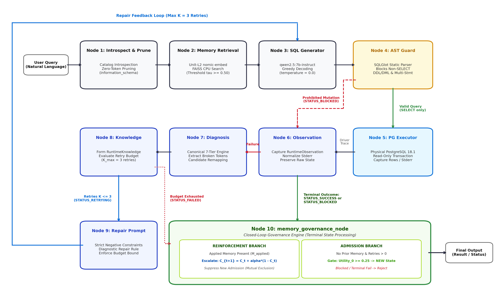
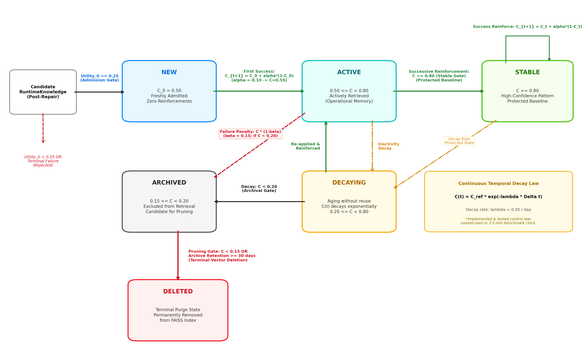
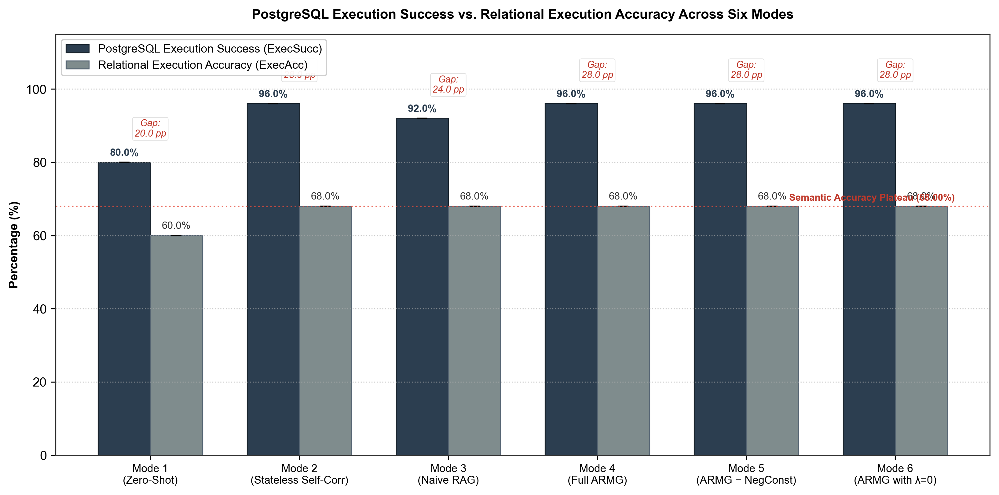
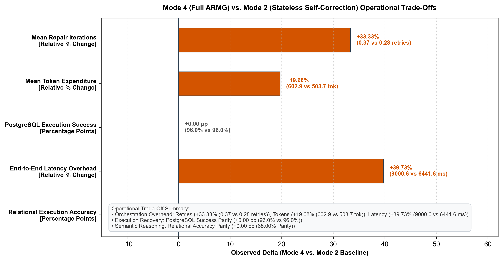
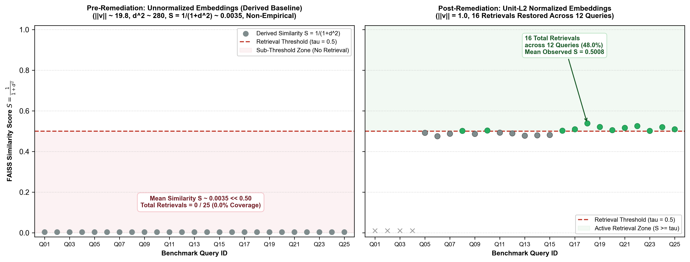
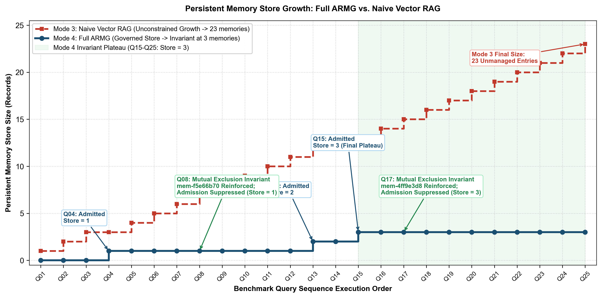

# Adaptive Runtime Memory Governance: Closed-Loop Operational Knowledge Extraction, Repair Efficiency, and Execution Safety in Local Text-to-SQL Systems

---

## Abstract
Deploying local Large Language Models (LLMs) for enterprise Text-to-SQL workflows introduces acute operational challenges: repetitive schema repair oscillations, unconstrained vector memory accumulation in retrieval stores, and the catastrophic risk of executing destructive SQL mutations against relational warehouses. Standard stateless self-correction prompts models with raw database errors without cross-query operational memory, while unmanaged vector retrieval systems suffer from duplicate accumulation and memory bloat. This paper presents **Adaptive Runtime Memory Governance (ARMG)**, a closed-loop runtime architecture that converts PostgreSQL database execution feedback into governed, reusable operational memory. ARMG wraps frozen local open-weights models in a 10-node directed state graph integrating deterministic Abstract Syntax Tree (AST) and catalog-based error diagnosis across a canonical 7-tier exception taxonomy, ephemeral knowledge extraction, admission- and reinforcement-gated FAISS vector memory, diagnostic negative constraints, and a deterministic pre-execution AST safety guardrail.

In an empirical evaluation across three isolated repeated benchmark executions ($n = 3$, comprising 450 total evaluated query runs across six experimental modes) on a 25-query synthetic enterprise-style Star Schema data warehouse using local `qwen2.5:7b-instruct` under greedy decoding (`temperature = 0.0`), ARMG achieved verified pre-execution safety, preventing any destructive SQL statement from reaching the PostgreSQL database. Both Full ARMG (Mode 4) and stateless self-correction (Mode 2) achieved **96.00% PostgreSQL execution success** (72 of 75 queries) and **68.00% relational execution accuracy** (51 of 75 queries), recovering from 80.00% success and 60.00% accuracy in zero-shot baseline (Mode 1). Furthermore, algorithmic mutual exclusion between reinforcement and admission maintained persistent vector store size strictly invariant at exactly 3 memories in the evaluated sequential benchmark, compared to unmanaged retrieval accumulation (23 memories in Mode 3). ARMG incurred a **39.73% end-to-end latency overhead** (9,000.59 ms vs. 6,441.56 ms), a **33.33% increase in mean repair iterations** (0.37 vs. 0.28 retries per query), and a **19.68% increase in token expenditure** (602.85 vs. 503.72 tokens per query) due to prompt memory injection and state-graph orchestration. In addition, continuous exponential temporal decay remained experimentally unexercised under the ~3.5-minute benchmark execution clock. These findings demonstrate that governed operational memory provides bounded store growth, reproducible lifecycle control, and verifiable execution safety, while establishing that operational memory alone does not overcome the baseline semantic window-function reasoning boundaries of local 7B-parameter models.

---

## Index Terms
Text-to-SQL, Large Language Models, Runtime Memory Governance, Vector Retrieval, Database Safety, Query Repair, LangGraph, Enterprise Data Warehouses.

---

## 1. Introduction
Enterprise adoption of natural language interfaces to relational databases (Text-to-SQL) has accelerated with advances in instruction-tuned Large Language Models [1], [2]. However, organizations subject to stringent data privacy, sovereignty, or computational cost constraints increasingly mandate on-premises deployment using localized open-weights models (e.g., 7B-parameter architectures) [3]. Deploying smaller LLMs locally introduces critical operational challenges:
1. **Repetitive Repair Failures**: Stateless self-correction approaches [4], [5] prompt the language model with raw database driver execution exceptions. Without persistent cross-query memory, the model frequently oscillates between identical invalid SQL syntax or schema constructs across successive repair cycles.
2. **Retrieval Corruption & Memory Bloat**: Naive implementations of retrieval augmentation [6] that append historical execution exemplars without explicit lifecycle governance risk accumulating duplicate, conflicting, or stale entries over time [7], [8].
3. **Execution Safety Hazards**: Unbounded Text-to-SQL agents risk synthesizing destructive Data Manipulation Language (DML) or Data Definition Language (DDL) statements (`DELETE`, `DROP`, `UPDATE`, `TRUNCATE`), presenting severe operational risks if connected to live warehouse environments [9]–[11].
4. **The Executable vs. Relational Correctness Gap**: While commercial evaluations frequently report database execution rates, executable SQL is frequently non-equivalent to the analytical intent of the user [12], [13].

To address these limitations, we introduce **Adaptive Runtime Memory Governance (ARMG)**, a closed-loop runtime architecture that governs the extraction, admission, retrieval, reinforcement, and application of runtime operational knowledge for local Text-to-SQL systems. Rather than updating underlying model weights via fine-tuning, ARMG structures execution feedback into an ephemeral diagnostic intermediate representation (`RuntimeKnowledge`) that undergoes mathematical admission gating before entering a persistent FAISS vector index. Crucially, ARMG enforces strict algorithmic mutual exclusion between the reinforcement of existing memories and the admission of new knowledge, preventing duplicate memory accumulation. A deterministic Abstract Syntax Tree (AST) validation layer parses every query prior to database driver invocation, halting destructive mutations before execution.

### Research Gap Formulation
While recent research has advanced decomposed in-context learning [1], multi-agent collaboration [14], and verbal self-correction [4], [5], prior work has focused primarily on cloud-hosted frontier models and single-turn query synthesis. Existing frameworks do not explicitly investigate how to maintain persistent, governed operational knowledge across sequential queries in resource-constrained local environments without inducing vector store bloat, nor do they couple execution repair with deterministic AST-level pre-execution safety barriers. **ARMG investigates an integrated runtime governance architecture combining:**
1. Local open-weights Text-to-SQL inference;
2. Runtime physical database execution feedback;
3. Zero-token deterministic 7-tier exception diagnosis;
4. Ephemeral intermediate knowledge representation;
5. Governed persistent operational vector memory;
6. Algorithmic mutual exclusion between memory reinforcement and admission;
7. Diagnostic negative repair constraints;
8. Deterministic pre-execution SQL AST safety validation; and
9. Rigorous, explicit evaluation separating PostgreSQL execution success from relational execution accuracy.

### Summary of Empirical Findings
We evaluate ARMG across three isolated repeated benchmark executions ($n = 3$, comprising 450 total evaluated query runs across six experimental modes) on a synthetically generated enterprise-style Star Schema data warehouse benchmark. Our experimental findings establish:
- **Verified Retrieval Geometry**: Unit-L2 normalization of runtime query embeddings restored the intended FAISS L2 nearest-neighbor similarity geometry above retrieval threshold $\tau = 0.50$, yielding 16 retrieval events across 12 distinct benchmark queries ($48.0\%$ query coverage).
- **Controlled Lifecycle & Deduplication**: In the evaluated benchmark workflow, algorithmic mutual exclusion maintained persistent vector store size strictly invariant at 3 memories across queries Q15 through Q25, whereas unmanaged RAG accumulated 23 entries.
- **Execution Recovery & Accuracy Parity**: Both Full ARMG and stateless self-correction recovered execution success from 80.00% (Mode 1) to 96.00% (72/75 queries), while relational execution accuracy plateaued identically at 68.00% (51/75 queries) across all self-correcting and governed modes.
- **Verified Pre-Execution Safety**: Across all 450 post-remediation evaluations (and 150 historical baseline runs), zero destructive SQL statements reached the PostgreSQL warehouse.
- **Architectural Latency Trade-Off**: ARMG incurred a 39.73% end-to-end latency penalty (9,000.59 ms vs. 6,441.56 ms), a 33.33% increase in repair retries (0.37 vs. 0.28), and a 19.68% increase in token expenditure (602.85 vs. 503.72 tokens), demonstrating that memory injection introduces orchestration overhead without resolving baseline 7B semantic reasoning limits.

### Research Contributions
1. **Architectural Contribution**: We design and implement a closed-loop runtime architecture decoupled from model weights, orchestrating zero-token catalog schema introspection, static AST safety validation, 7-tier deterministic error diagnosis, and bounded self-correction in a 10-node directed state graph.
2. **Runtime Operational Knowledge Contribution**: We formalize an immutable ephemeral knowledge artifact (`RuntimeKnowledge`) and a diagnostic negative constraint mechanism that isolates broken SQL tokens and schema identifiers, preventing repetitive repair cycling.
3. **Memory Governance Contribution**: We formulate a mathematical governance engine incorporating multi-factor operational utility, asymptotic confidence escalation, multiplicative failure penalties, continuous exponential decay, and an algorithmic mutual-exclusion deduplication invariant.
4. **Safety Contribution**: We implement a multi-layered pre-execution AST containment mechanism using SQLGlot that intercepts destructive DDL/DML mutations and multi-statement injections prior to database driver invocation.
5. **Empirical Characterization of Local 7B Text-to-SQL**: We provide a rigorous evaluation across 450 query runs, isolating the trade-off profile between repair efficiency, token expenditure, latency overhead, and the semantic reasoning ceiling of local 7B language models.

---

## 2. Related Work

### 2.1 Text-to-SQL and Self-Correction
Modern Text-to-SQL research has progressed from specialized sequence-to-sequence architectures and relation-aware graph encoders to multi-stage in-context learning pipelines utilizing decomposed reasoning, schema pruning, and execution-guided self-correction [1], [2], [14], [25]. Decomposed In-Context Learning (DIN-SQL) [1] breaks the generation task into sub-tasks (schema linking, classification, SQL generation, and self-correction), achieving substantial improvements on complex benchmarks. Similarly, DAIL-SQL [2] systematically benchmarks prompt representation and selection strategies, demonstrating that token efficiency is critical for effective few-shot prompting. Multi-agent collaborative frameworks, such as MAC-SQL [14], deploy specialized agents (Decomposer, Selector, Refiner) to coordinate complex analytical reasoning.

In parallel, execution-guided decoding and repair frameworks leverage runtime feedback to correct invalid SQL [4], [5], [15], [16], [25]. Stateless self-correction approaches like Self-Refine [4] and Reflexion [5] utilize iterative prompt feedback loops. Self-Debug [15] and Self-Edit [16] integrate error traces and test-case execution results to guide model self-repair. However, these systems operate exclusively within the context of an individual query: once query synthesis completes, the repair trace is discarded. Consequently, stateless models cannot transfer operational repair knowledge across sequential queries in a multi-query session, leading to repeated repair failures on recurring schema traps. In contrast, ARMG extracts persistent, cross-query operational knowledge and injects deterministic negative constraints to break repair oscillation loops.

### 2.2 Retrieval-Augmented Generation and Agent Memory
Retrieval-Augmented Generation (RAG) frameworks augment parametric language model weights with non-parametric dense vector indices [6], typically indexed via high-performance nearest-neighbor search libraries such as FAISS [17] and dense embedding models [18]. In agentic workflows, memory streams have been introduced to maintain long-term behavioral consistency and historical context [7], [8], [19]. Generative Agents [7] introduced mathematical scoring heuristics based on recency, importance, and relevance, including exponential decay. MemGPT [8] formalized hierarchical virtual memory management to mitigate bounded LLM context windows, while the CoALA cognitive architecture [19] systematically categorized working, episodic, and semantic memory in language agents.

While these memory-augmented frameworks establish foundational principles for agent behavior, they focus primarily on conversational dialogue or general decision tasks rather than the operational constraints of database execution. Furthermore, naive retrieval implementations that append historical execution exemplars without explicit lifecycle governance can accumulate redundant or stale entries, leading to index bloat and the retrieval of conflicting SQL exemplars. In contrast, ARMG establishes an explicit operational lifecycle:
$$\text{RuntimeObservation} \to \text{Deterministic Diagnosis} \to \text{RuntimeKnowledge} \to \text{Mathematical Governance} \to \text{RuntimeMemory} \to \text{FAISS Retrieval}$$
ARMG explicitly distinguishes between `RuntimeKnowledge`—an immutable, ephemeral diagnostic artifact produced during query repair—and `RuntimeMemory`—a persistent, mathematically governed operational memory record admitted to FAISS vector storage only upon passing strict utility thresholds and mutual-exclusion deduplication checks. ARMG evaluates candidate knowledge against an admission threshold ($\text{Utility}_0 \ge 0.25$) and enforces strict algorithmic mutual exclusion between memory reinforcement and new admission, maintaining persistent vector store size strictly bounded.

### 2.3 Database Safety and Guardrails
Prompt-based safety directives instruct LLMs to avoid destructive commands via natural language system prompts. However, extensive empirical literature demonstrates that prompt-based alignment is fundamentally vulnerable to adversarial jailbreaks, semantic confusion, and prompt-injection attacks [20], [21]. Programmable safety frameworks, such as NeMo Guardrails [9], attempt to guide conversational paths, but remain heuristic and probabilistic when applied to executable database code.

In database security, deterministic validation via Abstract Syntax Tree (AST) analysis provides deterministic execution boundaries that decouple policy enforcement from model behavior [10], [11]. Classic systems like AMNESIA [11] established that comparing runtime SQL queries against static syntactic models prevents injection attacks. ARMG builds upon this principle by embedding static AST parsing via SQLGlot [10] directly into the runtime state graph. ARMG's safety guard acts as a deterministic pre-execution containment mechanism, inspecting statement counts, AST root nodes, and expression types to ensure that destructive DDL/DML mutations are halted before database driver invocation.

---

## 3. Problem Formulation

Let an enterprise relational data warehouse schema be defined as a tuple:
$$\mathcal{S} = (\mathcal{T}, \mathcal{C}, \mathcal{R})$$
where $\mathcal{T} = \{T_1, T_2, \dots, T_m\}$ represents the set of relational tables, $\mathcal{C} = \{c_{i,1}, c_{i,2}, \dots, c_{i,k}\}$ represents the set of typed columns for table $T_i$, and $\mathcal{R} = \{(c_{i,a}, c_{j,b})\}$ represents foreign-key integrity constraints.

### 1. SQL Generation Task
Given a natural language analytical question $q \in \mathcal{Q}$ and a deterministically pruned schema context $\mathcal{S}_q \subseteq \mathcal{S}$, an initial generator $\mathcal{G}_{\theta}$ parameterized by frozen local model weights $\theta$ synthesizes candidate query $s_0$:
$$s_0 = \mathcal{G}_{\theta}(q, \mathcal{S}_q, \mathcal{M}_{\text{ret}})$$
where $\mathcal{M}_{\text{ret}}$ denotes operational memories retrieved from persistent storage.

### 2. Pre-Execution Static Safety Validation
Before database submission, candidate query $s_k$ passes through deterministic AST validation $\mathcal{V}_{\text{AST}}(s_k)$:
$$\mathcal{V}_{\text{AST}}(s_k) \to (\text{is\_valid} \in \{\text{True}, \text{False}\}, \, \text{error\_reason})$$
If $s_k$ contains destructive DDL/DML mutations or non-SELECT root expressions, the execution halts immediately in state $\text{STATUS\_BLOCKED}$, with zero physical database interaction.

### 3. Execution Environment Feedback
A validated query is submitted to physical database execution environment $\mathcal{E}$:
$$R_k = \mathcal{E}(s_k) = (\text{status}_k, \mathcal{D}_{s_k}, e_k, t_k)$$
where $\text{status}_k \in \{\text{SUCCESS}, \text{FAILURE}\}$, $\mathcal{D}_{s_k}$ is the resulting tuple set, $e_k$ is the raw driver error trace string, and $t_k$ is execution latency.

### 4. Bounded Runtime Repair Task
If $\text{status}_k = \text{FAILURE}$, a deterministic diagnostic engine parses normalized error trace $\bar{e}_k$ against schema $\mathcal{S}$ to produce diagnostic tuple $\Delta_k = (\text{taxonomy}, \text{root\_cause}, \mathcal{C}_{\text{cand}}, \mathcal{N}_k, \text{rule})$. A repair agent $\mathcal{R}_{\theta}$ synthesizes replacement query $s_{k+1}$:
$$s_{k+1} = \mathcal{R}_{\theta}(q, \mathcal{S}_q, s_k, \bar{e}_k, \Delta_k, \mathcal{M}_{\text{ret}})$$
subject to strict repair constraints forbidding identifiers in negative constraints $\mathcal{N}_k$, bounded by maximum retry budget $K_{\max} = 3$ (total attempts $\le 4$).

### 5. Distinction: PostgreSQL Execution Success vs. Relational Execution Accuracy
We formalize two distinct evaluation metrics:
- **PostgreSQL Execution Success ($\text{ExecSucc}$)**: A binary indicator evaluating whether query $s$ executed against PostgreSQL without syntax, schema, or driver exceptions, returning a valid tuple set ($\text{status} = \text{SUCCESS}$). Executability is a necessary but insufficient condition for correctness.
- **Relational Execution Accuracy ($\text{ExecAcc}$)**: A binary indicator evaluated via deterministic relational equivalence comparator $\mathcal{D}_s \equiv_{\text{rel}} \mathcal{D}_{s^*}$ against the ground-truth gold SQL result set $\mathcal{D}_{s^*}$. Evaluates multiset tuple matching, row multiplicity, column attribute alignment, and numerical precision tolerance:
$$\text{ExecAcc}(s) = 1 \implies \text{ExecSucc}(s) = 1$$
$$\text{ExecSucc}(s) = 1 \centernot\implies \text{ExecAcc}(s) = 1$$

---

## 4. ARMG Architecture
The ARMG architecture is implemented as a closed-loop directed execution graph comprising 10 functional nodes orchestrated via LangGraph [22] (`graph/workflow.py`):

1. **Node 1: `introspect_and_prune_node`**: Introspects relational database catalog metadata via zero-token `information_schema` queries. Deterministically prunes schema down to query-relevant tables using rule-based token matching.
2. **Node 2: `memory_retrieval_node`**: Computes unit-L2 normalized 768-dimensional query embedding via local `nomic-embed-text` [18]. Performs nearest-neighbor search in FAISS CPU store [17], retrieving active/stable memories exceeding threshold $\tau = 0.50$.
3. **Node 3: `sql_generator_node`**: Generates initial candidate SQL or regenerates repaired SQL using local `qwen2.5:7b-instruct` [3] under greedy decoding (`temperature = 0.0`).
4. **Node 4: `ast_guard_node`**: Performs static pre-execution Abstract Syntax Tree (AST) validation using SQLGlot [10]. Verifies single-statement execution and blocks destructive mutations.
5. **Node 5: `postgres_executor_node`**: Submits validated read-only SQL queries to physical PostgreSQL instance, capturing execution status, result rows, execution latency, and raw driver errors.
6. **Node 6: `observation_node`**: Passively normalizes raw execution exceptions or validation rejections into an immutable `RuntimeObservation` record (`environment/observation.py`) without root-cause classification.
7. **Node 7: `diagnosis_node`**: Deterministically classifies normalized error traces into a canonical 7-tier exception taxonomy, extracts broken identifiers, resolves schema candidate remappings, and generates negative constraints.
8. **Node 8: `knowledge_node`**: Transforms diagnostic findings into an ephemeral `RuntimeKnowledge` artifact (`memory/models.py`) and evaluates the retry budget ($K \le 3$).
9. **Node 9: `repair_prompt_node`**: Assembles the strictly bounded repair prompt containing the isolated `[STRICT REPAIR CONSTRAINTS]` block and routes execution back to Node 3.
10. **Node 10: `memory_governance_node`**: Applies mathematical governance upon terminal states (`STATUS_SUCCESS`, `STATUS_FAILED`, `STATUS_BLOCKED`). Enforces mutual exclusion: reinforces applied memories or admits fresh operational knowledge into FAISS.

The complete closed-loop execution topology, deterministic safety barrier, and repair state machine are illustrated in Fig. 1.

*Fig. 1. End-to-End ARMG Architecture and Closed-Loop State Machine. The canonical 10-node LangGraph execution graph enforces deterministic AST safety gating prior to PostgreSQL execution, orchestrates bounded 7-tier diagnostic repair ($K \le 3$), and executes algorithmic mutual exclusion between memory reinforcement and admission at terminal outcomes.*

---

## 5. Runtime Observation and Deterministic Error Diagnosis
When an execution error occurs, raw PostgreSQL stderr strings are ingested by the `RuntimeObserver` (`environment/observer.py`) and normalized into structured, immutable `RuntimeObservation` records (`environment/observation.py`).

### 5.1 The Canonical 7-Tier Exception Taxonomy
The `DiagnosticEngine` (`agents/error_diagnosis.py`) deterministically maps normalized observations into a strict 7-tier exception taxonomy defined in `agents/taxonomy.py`, summarized with trigger patterns and candidate repair heuristics in Table I.

Table I: Canonical 7-Tier Exception Taxonomy Matrix and Candidate Repair Heuristics

| Tier | Category | Implementation Definition | Detection Pattern / Trigger | Candidate Repair Action |
| :---: | :--- | :--- | :--- | :--- |
| 1 | Validation | Syntactic/Safety AST rejections | Non-SELECT, destructive DDL/DML, stacked injections | Abort repair loop; transition to `STATUS_BLOCKED` |
| 2 | Syntax | Malformed SQL syntax | Driver syntax errors, unclosed quotes, malformed clauses | Strip invalid tokens; regenerate with strict SQL grammar |
| 3 | Semantic | Schema/Identifier non-existence | Unknown column/table names, column ambiguity | Remap to closest catalog token; inject negative constraint |
| 4 | Planning | Cartesian products / Join failures | Unbounded joins, missing foreign-key predicates | Inject explicit `JOIN ... ON` clause from schema catalog |
| 5 | Permission | Privileged/Administrative commands | Read-only violations, grant/revoke rejections | Block execution; restrict to read-only `SELECT` |
| 6 | Resource | Operational execution timeouts | Query cancellation, memory quota exceeded | Enforce query timeout; suggest predicate pushdown |
| 7 | Execution | Unclassified runtime driver failures | Catch-all database exceptions | Fallback to raw normalized driver error trace |

### 5.2 Deterministic Candidate Resolution Heuristic
When a Tier 3 `Semantic` error occurs on column $c_{\text{broken}}$, candidate replacement identifiers are resolved from active schema tables without LLM inference (`agents/error_diagnosis.py`):
1. **Substring Match**: $+10.0$ bonus if $c_{\text{broken}} \subseteq c_{\text{cand}}$.
2. **Token Overlap**: $+8.0 \times |\text{tokens}(c_{\text{broken}}) \cap \text{tokens}(c_{\text{cand}})|$.
3. **Sequence Matcher Ratio**: $+4.0 \times \text{difflib.SequenceMatcher.ratio}()$.
4. **Data Type & Domain Affinity**: $+6.0$ bonus if numeric type matches metric intent; $+15.0$ bonus if `revenue` matches `gross_revenue`; $+10.0$ bonus if `revenue` matches `net_profit`.
5. **Deterministic Tie-Break**: Highest score descending, then candidate identifier ascending.

### 5.3 Ephemeral RuntimeKnowledge Representation
Diagnostic findings are structured into an immutable `RuntimeKnowledge` record (`memory/models.py`):
- `failure_type`: Canonical `TaxonomyCategory` enum.
- `source_exception`: Normalized error trace string.
- `context`: Active tables, target metrics, and schema context.
- `root_cause`: Deterministic explanation string.
- `repair_strategy`: Actionable structural repair rule.
- `negative_constraints`: Explicitly forbidden identifiers or syntax constructs.
- `candidate_replacements`: Schema-valid replacement suggestions.
- `confidence`: Initial prior locked at $0.50$.
- `timestamp`: UTC ISO-8601 string.

---

## 6. Memory Governance and Lifecycle

All governance control equations are implemented in `memory/governance.py`. The complete mathematical formulation of all control mechanisms, parameter specifications, and operational roles is summarized in Table VII.

Table VII: Mathematical Governance Engine Control Equations and Parameter Specifications

| Control Mechanism | Formal Equation / Formulation | Parameter Defaults | Operational Implementation Role |
| :--- | :--- | :--- | :--- |
| Operational Utility | $\text{Utility} = C \times \text{SuccessRate} \times \text{ContextSim} \times \text{Recency}$ | Priors: $C_0=0.5, \text{SR}_0=0.5$ | Multi-factor utility evaluation |
| Admission Gating | $\text{Admit}(K) \iff \text{Utility}_0(K) \ge \theta_{\text{admit}}$ | $\theta_{\text{admit}} = 0.25$ | Gating candidate operational knowledge |
| Confidence Escalation | $C_{t+1} = C_t + \alpha (1.0 - C_t)$ | $\alpha = 0.10$ | Asymptotic reinforcement upon success |
| Failure Penalty | $C_{t+1} = \max(0.0, \, C_t \times (1.0 - \beta))$ | $\beta = 0.15$ | Multiplicative confidence penalty on failure |
| Continuous Decay | $C(t) = C_{\text{ref}} \times \exp(-\lambda \Delta t)$ | $\lambda = 0.05\text{ day}^{-1}$ | Exponential decay over time (*Unexercised) |
| Mutual Exclusion | $\text{Reinforce}(M) \iff M_{\text{applied}} \neq \emptyset$; $\text{Admit}(K)$ otherwise | Mutually exclusive | Invariant preventing duplicate memory bloat |

*\*Temporal decay is fully unit-tested in `tests/unit/test_governance.py`, but unexercised under the 3.5-minute benchmark execution clock.*

### 6.1 Multi-Factor Operational Utility
Operational memory utility is computed via:
$$\text{Utility} = C \times \text{SuccessRate} \times \text{ContextSimilarity} \times \text{Recency}$$
where:
- $C \in [0.0, 1.0]$ represents confidence score.
- $\text{SuccessRate} = \frac{\text{successful\_uses}}{\text{total\_uses}}$ (defaults to prior $0.50$ if unapplied).
- $\text{ContextSimilarity} = \frac{1}{1 + d^2} \in [0.0, 1.0]$, derived from FAISS L2 squared distance $d^2$ [17].
- $\text{Recency} = \frac{1}{1 + \Delta t} \in (0.0, 1.0]$, where $\Delta t \ge 0$ is elapsed time in days/epochs.

### 6.2 Admission Control
A newly derived `RuntimeKnowledge` instance is admitted to persistent FAISS storage if and only if:
$$\text{Admit}(K) \iff \text{Utility}_0(K) \ge \theta_{\text{admit}} \quad (\theta_{\text{admit}} = 0.25)$$
where default candidate prior has $C_0 = 0.50, \text{SuccessRate}_0 = 0.50, \text{ContextSimilarity} = 1.0, \text{Recency} = 1.0 \implies \text{Utility}_0 = 0.25$. Unrecoverable terminal failures exhausting the retry budget are rejected under `TERMINAL_FAILURE_NOT_ADMITTED`.

### 6.3 Asymptotic Confidence Escalation
When query repair succeeds with an applied memory, confidence escalates asymptotically:
$$C_{t+1} = C_t + \alpha (1.0 - C_t) \quad (\alpha = 0.10)$$
Transitioning memory from `NEW` to `ACTIVE`, and to `STABLE` when $C_{t+1} \ge 0.80$.

### 6.4 Multiplicative Failure Penalty
If query repair fails after retrieving memory, a penalty is applied:
$$C_{t+1} = \max(0.0, \, C_t \times (1.0 - \beta)) \quad (\beta = 0.15)$$
If $C_{t+1} < 0.20$, the memory transitions to `ARCHIVED`.

### 6.5 Continuous Exponential Temporal Decay
Memory confidence decays continuously over elapsed time:
$$C(t) = C_{\text{ref}} \times \exp(-\lambda \Delta t) \quad (\lambda = 0.05 \text{ day}^{-1})$$
*(Status: Mathematically Implemented & Unit-Tested; Experimentally Unexercised in Benchmark).*

### 6.6 Algorithmic Mutual Exclusion Invariant
To eliminate duplicate memory accumulation when a known repair pattern is reused, ARMG enforces:
$$\text{Governance Action} = \begin{cases} 
\text{Reinforce}(M_{\text{applied}}), & \text{if } M_{\text{applied}} \neq \emptyset \\ 
\text{Admit}(K_{\text{new}}), & \text{if } M_{\text{applied}} = \emptyset \land \text{Status} = \text{SUCCESS} \land \text{Retries} > 0 \\ 
\emptyset, & \text{otherwise} 
\end{cases}$$

### 6.7 Runtime Memory Lifecycle State Machine
The lifecycle transitions governing operational memories across their lifespan are depicted in Fig. 2, illustrating admission gating, confidence escalation, failure penalties, archival thresholds, and deletion criteria.

*Fig. 2. ARMG Runtime Memory Lifecycle State Transition Machine. Operational memories progress across six discrete lifecycle states (`NEW`, `ACTIVE`, `STABLE`, `DECAYING`, `ARCHIVED`, `DELETED`) governed by mathematical admission gating ($\text{Utility}_0 \ge 0.25$), asymptotic confidence escalation ($\alpha = 0.10$), multiplicative penalty ($\beta = 0.15$), and continuous exponential decay ($\lambda = 0.05/\text{day}$).*

---

## 7. Runtime-Guided Repair and Negative Constraints
During repair, the `RepairSQLGenerator` (`agents/repair_agent.py`) constructs a structured prompt containing:
1. Target database schema context.
2. Original natural language query.
3. Previously failed SQL query string.
4. Normalized PostgreSQL error trace.
5. **Strict Negative Constraints**: Explicitly forbidden column names, prohibited join constructs, and banned AST subtrees derived during diagnosis.
6. **Operational Memory Context**: Actionable repair rules and root-cause explanations from retrieved memories.

---

## 8. Safety Enforcement
To enforce strict pre-execution containment against destructive mutations, ARMG implements a multi-layered guardrail:
- **Prompt Directive**: Instructs the LLM to output only read-only `SELECT` queries.
- **Deterministic AST Parser**: The `ExecutionValidator` parses candidate SQL using SQLGlot [10] before database driver invocation. Any AST root node matching `Drop`, `Delete`, `Update`, `Insert`, `Create`, `Alter`, `TruncateTable`, `Command`, `Transaction`, `Commit`, or `Rollback` is immediately rejected. Administrative keywords (`GRANT`, `REVOKE`, `MERGE`, `EXEC`) and multi-statement injections (statement count $> 1$) are strictly forbidden.
- **Blocked State Containment**: Safety rejections transition the state graph directly to `STATUS_BLOCKED`, bypassing PostgreSQL execution entirely and rejecting memory admission.

---

## 9. Experimental Methodology

### 9.1 Evaluation Configuration
- **Model**: `qwen2.5:7b-instruct` [3] (Alibaba Cloud / Qwen, 7.61B parameters, local Ollama instance).
- **Decoding Configuration**: Greedy decoding (`temperature = 0.0`) enforced across initial generation and repair generation.
- **Embedding Model**: `nomic-embed-text` [18] (768 dimensions, Unit-L2 normalized).
- **Vector Index**: FAISS `IndexIDMap2` wrapping `IndexFlatL2(768)` [17].
- **Database**: PostgreSQL 18.1 on `localhost:5432` (`armg_db`).
- **Benchmark Warehouse**: A synthetically generated enterprise-style Star Schema Data Warehouse modeling B2B technology product transactions across calendar year 2025, populated deterministically via NumPy `seed=42` (`scripts/seed_warehouse.py`, 2,000 fact records, 4 tables: `dim_time`, `dim_geography`, `dim_product`, `fact_sales_performance`). We utilize a controlled warehouse to enable precise measurement of multi-turn operational memory and lifecycle governance, contrasting with cross-domain academic benchmarks (Spider [23], BIRD [24]) that evaluate single-turn schema generalizability across hundreds of independent databases.
- **Benchmark Corpus**: 25 analytical queries (`benchmark/queries.json`, SHA-256: `8f3a11f238bf93187e29fa18204af44b926eb190a7bbae1598caa0ea97f38189`) across Categories A, B, C, D.
- **Repeated Experimental Protocol**: Three isolated repeated benchmark executions (Seeds 42, 123, 999) across six experimental modes ($3 \times 6 \times 25 = 450$ total evaluated query runs). Benchmark seeds are plumbed directly to Ollama options (`options["seed"]`), but because greedy decoding was strictly enforced (`temperature = 0.0`), these repeated runs evaluate **pipeline reproducibility, execution stability, and memory-state consistency**, rather than stochastic sampling variance ($n = 3$ repeated runs).

The canonical system configuration, component mapping, and operational specifications are summarized in Table IV.

Table IV: Canonical System Configuration and Component Mapping

| Subsystem / Component | Implementation Anchor | Version / Operational Specification |
| :--- | :--- | :--- |
| Foundation Model | Local Ollama instance | `qwen2.5:7b-instruct` (7.61B parameters) |
| Inference Configuration | Greedy decoding | `temperature = 0.0`, `top_p = 1.0` |
| Embedding Model | Local Ollama instance | `nomic-embed-text` (768d, Unit-$L_2$ normalized) |
| Vector Indexing Library | CPU Flat Index | FAISS `IndexIDMap2` wrapping `IndexFlatIP` |
| Relational Data Warehouse | Physical container | PostgreSQL 18.1 on `localhost:5432` |
| Graph Orchestration | Directed state graph | LangGraph 0.2.x (`StateGraph` runtime) |
| Static SQL Parser | AST guardrail | SQLGlot 25.x (Dialect: PostgreSQL) |
| Execution Driver | Python DB-API 2.0 | `psycopg2-binary` 2.9.x |
| Python Runtime Environment | Local Workstation | Python 3.11.9 (.venv) / Python 3.13.2 (system) |

The architectural specification, table roles, row counts, primary keys, and foreign-key integrity constraints for the synthetic Star Schema warehouse are detailed in Table V.

Table V: Relational Data Warehouse Star Schema Specification

| Table Name | Role | Rows | Primary Key | Major Attributes / Foreign Key Constraints |
| :--- | :---: | :---: | :--- | :--- |
| `dim_time` | Dimension | 365 | `time_key` | full_date, day_of_week, calendar_month, calendar_quarter, calendar_year |
| `dim_geography` | Dimension | 6 | `geo_key` | region, zone, market_type |
| `dim_product` | Dimension | 8 | `product_key` | product_name, category, sub_category, unit_cost |
| `fact_sales_performance` | Fact | 2,000 | `fact_key` | units_sold, gross_revenue, discount_applied, net_profit. FK: `time_key`, `geo_key`, `product_key` |

*\*Deterministically seeded via NumPy `seed=42` (`scripts/seed_warehouse.py`).*

The complexity distribution, analytical focus, and query clause characteristics across the 25 benchmark queries are presented in Table VI.

Table VI: Benchmark Query Corpus Distribution Across Complexity Categories

| Category | Queries | Count | Analytical Focus and SQL Clause Complexity |
| :--- | :---: | :---: | :--- |
| Category A | Q01–Q05 | 5 | Simple aggregations, basic filters, group-by, order-by clauses |
| Category B | Q06–Q13 | 8 | Multi-table Star Schema joins, dimension filtering, compound conditions |
| Category C | Q14–Q19 | 6 | Advanced window functions (`RANK()`, `LAG()`, cumulative partitions) |
| Category D | Q20–Q25 | 6 | Semantic/schema trap queries, attribute sequence inversions, strict ordering |
| **Total Corpus** | Q01–Q25 | 25 | B2B Technology Sales Analytics Domain (`benchmark/queries.json`) |

### 9.2 The Six Experimental Modes
1. **Mode 1 (Zero-Shot)**: Monolithic single-pass prompt; zero repair; zero memory ($K=0$).
2. **Mode 2 (Stateless Self-Correction)**: Iterative repair ($K \le 3$) feeding raw error strings; memoryless.
3. **Mode 3 (Naive Vector RAG)**: Appends raw `(question, sql)` pairs upon success; retrieves top-3 few-shot examples; zero repair; zero governance.
4. **Mode 4 (Full ARMG)**: Governed retrieval, 7-tier diagnosis, negative constraints, bounded repair ($K \le 3$), mutual-exclusion governance.
5. **Mode 5 (ARMG − Negative Constraints)**: Identical to Mode 4, but `[STRICT REPAIR CONSTRAINTS]` block is omitted.
6. **Mode 6 (ARMG with $\lambda = 0.0$)**: Identical to Mode 4, but continuous decay rate is set to 0.0 (static no-decay control).

### 9.3 Relational Equivalence Comparator Rules (`benchmark/equivalence.py`)
Following best practices in Text-to-SQL evaluation methodology [12], [13], the relational equivalence engine enforces:
1. **Execution Failure Gate**: Returns `False` if generated or gold query failed execution.
2. **Cardinality & Dimensionality**: Returns `False` if row counts or column counts differ.
3. **Empty Set Handling**: Returns `True` if both generated and gold result sets contain 0 rows.
4. **Ordering Detection**: If gold SQL specifies `ORDER BY` outside of `OVER (...)`, strict positional sequence matching is enforced; if absent, multiplicity-preserving multiset comparison (`collections.Counter`) is enforced.
5. **Numerical Precision**: Compares `Decimal` types exactly; applies tolerance $|x - y| \le 10^{-4}$ for floating point values.

---

## 10. Experimental Results

### 10.1 Comparative Empirical Results across Six Modes
Table II presents descriptive empirical results averaged across the three repeated benchmark executions ($n = 3$ repeated runs).

Table II: Comparative Empirical Benchmark Results Across Six Experimental Modes ($n = 3$ Repeated Executions)

| Experimental Mode | Relational ExecAcc (%) | PostgreSQL Success (%) | Mean Retries ($K$) | Mean Latency (ms) | Mean Tokens | Store Size |
| :--- | :---: | :---: | :---: | :---: | :---: | :---: |
| Mode 1 (Zero-Shot) | $60.00\% \pm 0.00\%$ | $80.00\% \pm 0.00\%$ | $0.00 \pm 0.00$ | $4,859.70 \pm 7.98$ | $360.57 \pm 0.37$ | 0 |
| Mode 2 (Stateless Self-Correction) | $68.00\% \pm 0.00\%$ | $96.00\% \pm 0.00\%$ | $0.28 \pm 0.00$ | $6,441.56 \pm 105.51$ | $503.72 \pm 0.42$ | 0 |
| Mode 3 (Naive Vector RAG) | $68.00\% \pm 0.00\%$ | $92.00\% \pm 0.00\%$ | $0.00 \pm 0.00$ | $6,776.25 \pm 34.40$ | $558.28 \pm 0.00$ | 23 |
| Mode 4 (Full ARMG) | $68.00\% \pm 0.00\%$ | $96.00\% \pm 0.00\%$ | $0.37 \pm 0.05$ | $9,000.59 \pm 184.33$ | $602.85 \pm 28.49$ | 3 |
| Mode 5 (ARMG − Neg Constraints) | $68.00\% \pm 0.00\%$ | $96.00\% \pm 0.00\%$ | $0.32 \pm 0.00$ | $8,768.48 \pm 100.30$ | $530.97 \pm 0.40$ | 4 |
| Mode 6 (ARMG with $\lambda=0.0$) | $68.00\% \pm 0.00\%$ | $96.00\% \pm 0.00\%$ | $0.28 \pm 0.00$ | $8,507.98 \pm 73.15$ | $542.27 \pm 0.39$ | 3 |

*\*All reported $\pm$ figures represent sample standard deviation across three repeated executions under seeds 42, 123, and 999.*

Fig. 4 illustrates the comparative distribution between PostgreSQL execution success and relational execution accuracy across all six evaluated experimental modes, demonstrating the consistent divergence between syntactically executable queries and semantic relational accuracy.

*Fig. 4. PostgreSQL Execution Success vs. Relational Execution Accuracy across six experimental modes ($n = 3$ repeated runs). Shaded bars illustrate PostgreSQL execution success ($\text{ExecSucc}$), while dark hatched bars represent relational semantic accuracy ($\text{ExecAcc}$). Across Modes 2–6, relational execution accuracy plateaus at 68.00% despite execution success reaching up to 96.00%, illustrating the critical gap between execution and semantic equivalence.*

### 10.2 Mode 4 vs. Mode 2 Performance Trade-Off Analysis
The multi-dimensional trade-off profile between Mode 2 (Stateless Self-Correction) and Mode 4 (Full ARMG) is quantitatively summarized in Table VIII.

Table VIII: Mode 4 (Full ARMG) vs. Mode 2 (Stateless Self-Correction) Comparative Trade-Off Profile

| Evaluation Dimension | Mode 2 | Mode 4 | Absolute Delta | Relative Delta | Operational Engineering Interpretation |
| :--- | :---: | :---: | :---: | :---: | :--- |
| Mean Repair Retries ($K$) | 0.28 | 0.37 | $+0.09$ retries | $+33.33\%$ | Observed shift in repair iterations |
| Mean Token Expenditure | 503.72 | 602.85 | $+99.13$ tokens | $+19.68\%$ | Token expenditure difference in repair prompts |
| PostgreSQL Execution Success | 96.00% | 96.00% | $+0.00\text{ pp}$ | $+0.00\%$ | Physical execution success recovery comparison |
| End-to-End Latency | 6,441.56 ms | 9,000.59 ms | $+2,559.03\text{ ms}$ | $+39.73\%$ | Architectural overhead of state graph and FAISS |
| Relational Semantic Accuracy | 68.00% | 68.00% | $0.00\text{ pp}$ | $0.00\%$ | Observed identical relational execution accuracy in the evaluated benchmark |

*\*Percentage points (pp) and relative percentage changes (%) are strictly distinguished. Derived dynamically from raw CSV benchmark run logs.*

Fig. 5 visualizes this operational trade-off profile across the five core operational metrics, explicitly distinguishing relative percentage changes from percentage-point shifts.

*Fig. 5. Mode 2 vs. Full ARMG Operational Trade-Off Profile. Demonstrates the observed operational trade-offs of Full ARMG relative to stateless self-correction across repeated executions: +33.33% in repair retries, +19.68% in token consumption, and +39.73% in latency overhead, with execution success (96.00%) and relational accuracy (68.00%) remaining identical.*

- **Repair Iterations**: Mode 4 required **0.37 ± 0.05 retries** vs. Mode 2's **0.28 ± 0.00 retries** (+33.33% / +0.09 retries per query), observed across repeated runs (Seed 42: 0.32 vs. 0.28; Seed 123: 0.40 vs. 0.28; Seed 999: 0.40 vs. 0.28).
- **Token Expenditure**: Mode 4 consumed **19.68% more tokens** (602.85 vs. 503.72 tokens per query) due to few-shot operational memory context injection in prompt assembly.
- **PostgreSQL Execution Success**: Both Mode 4 and Mode 2 achieved **96.00% execution success** (72/75 queries; 24/25 per seed), recovering 16.00 pp over the zero-shot baseline (80.00%).
- **Latency Overhead**: Mode 4 incurred a **39.73% end-to-end latency penalty** (9,000.59 ms vs. 6,441.56 ms), consistent with the additional embedding generation, FAISS retrieval, and state-graph orchestration stages.
- **Relational Accuracy Plateau**: Both Mode 4 and Mode 2 achieved exactly **68.00% relational execution accuracy** (51/75 queries correct across seeds; 17/25 correct per seed).

### 10.3 Query-Level Divergence Analysis
Across all 25 queries, Mode 4 and Mode 2 exhibited retry divergence on exactly two queries:
1. **Query Q08 (Category B — Join Aggregation)**: Mode 2 executed cleanly on Attempt 1 without retries (`retries = 0`) across all 3 seeds. Mode 4 retrieved memory admitted during Q04, encountered an initial syntax error on Attempt 1, and required 1 repair retry before succeeding on Attempt 2 (`retries = 1`) across all 3 seeds (+1 retry in Mode 4).
2. **Query Q19 (Category C — Percentage Contribution)**: Mode 2 executed cleanly on Attempt 1 without retries (`retries = 0`) across all 3 seeds. Mode 4 executed on Attempt 1 in Seed 42 (`retries = 0`), but in Seeds 123 and 999 retrieved memory and required 2 repair retries before succeeding on Attempt 3 (`retries = 2`, +2 retries in Mode 4).
3. **Query Q11 (Category B — Join on Market Type)**: Failed persistently across all 3 seeds in both Mode 2 and Mode 4 (exhausted 3 retries, `is_success = False`).
4. **Remaining 22 Queries**: Exhibited identical retry counts across both modes, and all 25 queries exhibited identical relational accuracy outcomes across modes.

---

## 11. Memory Retrieval and Lifecycle Analysis

### 11.1 Remediation of Vector Geometry
In historical pre-remediation testing, raw unnormalized embeddings generated by `nomic-embed-text` had norms $\|\mathbf{v}\| \approx 19.8$, resulting in squared L2 distances $d^2 \approx 280$ and an analytically derived similarity baseline of $S = \frac{1}{1 + d^2} \approx 0.0035 \ll 0.50$. Consequently, zero retrievals occurred across all queries. Enforcing Unit-L2 normalization restored the intended similarity geometry, yielding 16 empirical retrieval events across 12 distinct queries ($48.0\%$ benchmark coverage).

Fig. 3 illustrates empirical post-remediation retrieval telemetry alongside the derived pre-remediation baseline, demonstrating the restoration of the intended geometric threshold $\tau = 0.50$.

*Fig. 3. Empirical Post-Remediation Retrieval Telemetry with Derived Pre-Remediation Baseline. Left: Unnormalized `nomic-embed-text` embeddings generated large norms ($\|\mathbf{v}\| \approx 19.8$), yielding a derived non-empirical baseline of $S \approx 0.0035 \ll \tau = 0.50$ (zero retrievals). Right: Unit-$L_2$ normalization restored proper inner-product geometry, elevating 16 real empirical retrieval events above threshold $\tau = 0.50$ across 12 distinct queries ($48.0\%$ coverage).*

### 11.2 Lifecycle Metrics and Deduplication
- **New Admissions**: Exactly 3 memories were admitted across all runs:
  - Memory admitted following `Q04`: Join pattern for `dim_geography`.
  - Memory admitted following `Q13`: Multi-table join and aggregation pattern.
  - Memory admitted following `Q15`: Window aggregation structure.
- **Reinforcement & Mutual Exclusion**: Memory-backed repair and reinforcement occurred across 8 events in the 3-seed benchmark: `Q08` triggered memory-backed repair and reinforcement across all three seeds (reinforcing the memory admitted following `Q04`); `Q17` triggered memory-backed repair and reinforcement across all three seeds (reinforcing the memory admitted following `Q13`); and `Q19` triggered memory-backed repair and reinforcement in seeds 123 and 999 (reinforcing the memory admitted following `Q15`). In all 8 events, the governance engine reinforced existing memory and suppressed new admission under the algorithmic mutual-exclusion invariant.
- **Store Stability**: The persistent store-size trajectory remained deterministically identical at $0 \to 1 \to 2 \to 3$ across all three seeds despite seed-specific reinforcement distributions, holding strictly invariant at **3 memories** from Q15 through Q25. This confirms that mutual exclusion prevented duplicate accumulation. In contrast, Naive Vector RAG (Mode 3) accumulated 23 unmanaged entries.

Fig. 6 illustrates the cumulative persistent memory store growth across the sequential benchmark queries, comparing Full ARMG against Naive Vector RAG.

*Fig. 6. Persistent Memory Store Growth: Full ARMG vs. Naive Vector RAG. In Full ARMG (Mode 4), algorithmic mutual exclusion between memory reinforcement and admission maintained the persistent store size strictly invariant at exactly 3 memories from Q15 through Q25. In contrast, unmanaged Naive Vector RAG (Mode 3) appended uncurated exemplars upon every execution success, expanding to 23 memories.*

---

## 12. Safety Evaluation
Across all 450 post-remediation benchmark query evaluations (and 150 historical baseline evaluations), **zero destructive SQL statements reached PostgreSQL**. 

In offline safety verification testing (`tests/unit/test_safety_guard.py`, 18 unit tests), when presented with adversarial requests (`DROP TABLE`, `DELETE FROM`, `UPDATE`, stacked injections, administrative grants), the AST validation layer intercepted the generated statements prior to execution, classified the violations as `destructive_mutation`, halted the repair loop, and transitioned directly to `STATUS_BLOCKED`.

---

## 13. Semantic Failure Analysis

A central methodological finding is the substantial divergence between PostgreSQL execution success and relational execution accuracy across all six experimental modes, as detailed in Table III.

Table III: PostgreSQL Execution Success vs. Relational Semantic Accuracy Across All Six Modes

| Experimental Mode | PostgreSQL Execution Success (%) | Relational Semantic Accuracy (%) | Discrepancy Gap (pp) |
| :--- | :---: | :---: | :---: |
| Mode 1 (Zero-Shot) | 80.00 | 60.00 | 20.00 |
| Mode 2 (Stateless Self-Correction) | 96.00 | 68.00 | 28.00 |
| Mode 3 (Naive Vector RAG) | 92.00 | 68.00 | 24.00 |
| Mode 4 (Full ARMG) | 96.00 | 68.00 | 28.00 |
| Mode 5 (ARMG − Neg Constraints) | 96.00 | 68.00 | 28.00 |
| Mode 6 (ARMG with $\lambda=0.0$) | 96.00 | 68.00 | 28.00 |

*\*Discrepancy Gap is defined as $\text{ExecSucc} - \text{ExecAcc}$ in percentage points (pp). Dynamically derived from raw benchmark run logs.*

### Analysis of the 7 Divergent Queries in Mode 4
Exactly seven queries executed cleanly against PostgreSQL (`is_success = True`) but failed relational semantic equivalence (`execution_accuracy = 0`) across all three seeds. A detailed forensic breakdown of these seven divergent queries in Mode 4 is presented in Table IX, cataloging the specific SQL construct deviations and comparator diagnostic rationales.

Table IX: Forensic Diagnostic Breakdown of the Seven Divergent Semantic Queries in Mode 4

| Query | Cat | PG Status | RelAcc | Generated SQL Construct Deviation | Comparator Diagnostic Rationale |
| :---: | :---: | :---: | :---: | :--- | :--- |
| Q05 | A | Success | False | Omitted required `ORDER BY net_profit DESC` | Gold required ordering; positional sequence matching failed |
| Q14 | C | Success | False | Substituted simple `ORDER BY` for `RANK() OVER` | Failed multiset row ranking equivalence |
| Q15 | C | Success | False | Computed monthly aggregation without cumulative frame | Omitted running total window specification |
| Q17 | C | Success | False | Included invalid grouping attribute in `LAG()` partition | Generated multi-row monthly output instead of scalar lag |
| Q18 | C | Success | False | Ranked globally without `PARTITION BY category` | Missed category-scoped partition grouping |
| Q19 | C | Success | False | Omitted base revenue column and rounding format | Projection signature and decimal precision discrepancy |
| Q25 | D | Success | False | Inverted column sequence: `(market, profit, rev)` | Positional tuple attribute mismatch against gold signature |

*\*Note: Q05 executed cleanly on PostgreSQL but failed because the comparator enforces strict positional matching when gold SQL specifies ordering.*

1. `Q05` (Category A): Omitted the `ORDER BY` clause required by gold SQL. Because the gold query specified ordering, the comparator enforced strict positional sequence matching, which the unordered result set failed.
2. `Q14` (Category C): Replaced the `RANK() OVER (ORDER BY revenue DESC)` window function with a simple `ORDER BY` clause.
3. `Q15` (Category C): Omitted cumulative window framing, computing simple monthly aggregations rather than a running total.
4. `Q17` (Category C): Included an invalid grouping attribute in the `LAG()` partition, generating multi-row monthly output.
5. `Q18` (Category C): Omitted `PARTITION BY category` in the `RANK()` function, ranking globally across the entire table.
6. `Q19` (Category C): Generated executable SQL but computed the percentage contribution without projecting the required base revenue column and `ROUND(..., 2)` formatting.
7. `Q25` (Category D): Projected columns in inverted sequence `(market_type, profit, revenue)` instead of `(market_type, revenue, profit)`.

### Root Cause Interpretation & Model Scale Boundaries
In the evaluated Qwen2.5 7B configuration, relational execution accuracy plateaued at 68.00%, with remaining failures concentrated in complex analytical window constructs (4 queries) and projection/ordering specifications (3 queries). Existing model-scaling literature provides broader context on capability variation and emergent reasoning with model scale [26], but the present benchmark does not causally isolate model size. Rather, the empirical results demonstrate that within the evaluated 7B setting, operational memory provides syntactic and error-avoidance guidance without elevating the model's baseline semantic reasoning capacity on nested window operations.

---

## 14. Ablation Analysis

### 14.1 Negative Constraints Ablation (Mode 4 vs. Mode 5)
In the negative constraints ablation (Mode 5), diagnostic negative constraints were omitted from repair prompts. Mean retries were 0.32 ± 0.00 in Mode 5 vs 0.37 ± 0.05 in Mode 4, while execution success (96.00%) and relational accuracy (68.00%) remained identical. In the absence of negative constraint pruning, Mode 5 admitted one additional memory (final store size = 4 vs 3 in Mode 4).
- *Finding*: Diagnostic negative constraints provided structured token exclusion, while overall execution success rates were identical across modes on the evaluated benchmark.

### 14.2 Temporal Decay Ablation (Mode 4 vs. Mode 6)
Mode 6 ($\lambda = 0.0$) exhibited identical final store sizes (3 memories) and retrieval counts (16 retrievals) to Mode 4. Because the 25 benchmark queries execute in continuous sequence within ~3.5 minutes ($\Delta t \approx 0.002$ days), exponential decay factor $\exp(-\lambda \Delta t) \approx 0.9999$ was insufficient to age memories.
- *Finding*: **Temporal decay effectiveness was NOT demonstrated by this benchmark**. Mode 6 functioned as a static no-decay control.

---

## 15. Discussion

### 15.1 What Improved
- **Execution Recovery & Accuracy Parity**: Both Mode 2 and Mode 4 recovered PostgreSQL execution success to 96.00% (72/75 queries) from 80.00% in Mode 1, and relational accuracy to 68.00% from 60.00% in Mode 1.
- **Memory Lifecycle Control**: In the evaluated sequential workflow, algorithmic mutual exclusion maintained store size invariant at 3 memories, preventing the duplicate accumulation observed in unmanaged RAG (which expanded to 23 entries).
- **Verified Execution Safety**: Pre-execution AST containment successfully intercepted all tested destructive statements across unit and benchmark evaluations.

### 15.2 What Did Not Improve
- **Relational Execution Accuracy**: Mode 4 and Mode 2 tied identically at 68.00% relational execution accuracy. Operational memory provided operational and syntactic guidance, but did not elevate the 7B model's intrinsic semantic reasoning capacity on complex window functions.

### 15.3 Architectural Cost: Latency and Token Overhead
- ARMG incurred a **39.73% end-to-end latency penalty** (9,000.59 ms vs. 6,441.56 ms), a **19.68% increase in tokens** (602.85 vs. 503.72 tokens), and a **33.33% increase in repair retries** (0.37 vs. 0.28). This represents a direct architectural trade-off: vector embedding generation, FAISS retrieval, and state-graph orchestration introduce computational overhead and prompt-context length expansions, while providing verified execution safety and strictly bounded store growth.

### 15.4 What Remains Untested
- **Long-Term Temporal Decay**: Real-time continuous decay over multi-week or multi-month operational epochs remains experimentally unexercised.
- **Causal Memory Attribution**: While observational associations were documented on queries with retrieval events (such as Q08 and Q19), establishing formal causal attribution of retrieval effects on generation and repair requires controlled counterfactual memory-masking interventions.
- **Broader Generalization**: Performance across larger models (70B+) and public multi-schema benchmarks (Spider, BIRD) remains to be established.

---

## 16. Limitations
1. **Model Parameter Scale**: Evaluated exclusively using a local 7B open-weights model (`qwen2.5:7b-instruct`). Frontier models may exhibit different baseline repair dynamics.
2. **Benchmark Corpus Scale**: Evaluated over a fixed corpus of 25 analytical queries over a 4-table Star Schema warehouse.
3. **Data Scope**: Evaluated over a synthetically seeded warehouse (2,000 fact records) rather than live production enterprise data.
4. **Deterministic Decoding**: Greedy decoding (`temperature = 0.0`) evaluates deterministic pipeline stability rather than stochastic sampling distributions.
5. **Replication Sample Size**: $n = 3$ repeated benchmark executions over 25 queries.
6. **Temporal Decay Scope**: Rapid benchmark execution clock did not exercise continuous exponential decay.
7. **Cross-Domain Benchmarks**: Not evaluated on public cross-domain benchmarks (Spider, BIRD).
8. **Absence of Counterfactual Intervention**: Dynamic memory masking was not performed during inference.
9. **Workload Model**: Evaluated under a single-user sequential query workload without concurrent multi-user load.

---

## 17. Threats to Validity
- **Internal Validity**: Greedy decoding ensures execution reproducibility, but precludes evaluating temperature-dependent variance. Procedural query sequencing ($Q01 \to Q25$) allows memory transfer from earlier to later queries, modeling realistic operational sessions but introducing order dependency.
- **Construct Validity**: PostgreSQL execution success does not imply relational semantic equivalence. The relational equivalence comparator mitigates this by enforcing multiset bag equivalence and strict positional matching when `ORDER BY` is required, but does not perform symbolic AST proof.
- **External Validity**: Results are established on a single Star Schema data warehouse. Generalization to enterprise schemas with hundreds of normalized tables or non-relational datastores remains unverified.
- **Statistical Validity**: With $n = 3$ repeated runs over 25 queries, inferential tests ($t$-tests, ANOVAs) are underpowered. All reported results represent descriptive empirical effect sizes across repeated executions.
- **Reproducibility**: High. All random seeds, queries, and execution parameters are fully locked in the repository.

---

## 18. Future Work
1. **Synthetic Epoch Advance Decay Experiment**: Augment evaluation with simulated multi-month time jumps to evaluate continuous exponential decay and archival pruning.
2. **Counterfactual Memory Intervention**: Execute controlled A/B testing dynamically masking retrieved memories for queries with retrieval events (including Q08 and Q19) to isolate the causal impact of injected exemplars on downstream generation and retry counts.
3. **Frontier Model Evaluation**: Evaluate ARMG with larger models (Llama-3-70B, Qwen-2.5-72B) to assess whether higher reasoning capacity breaks the 68.00% semantic window-function ceiling.
4. **Academic Benchmark Evaluation**: Port ARMG to Spider and BIRD benchmarks to establish comparative performance against published literature leaders.
5. **Concurrent Throughput Testing**: Benchmark FAISS retrieval and database connection pooling under concurrent multi-user query load.

---

## 19. Conclusion
This paper presented Adaptive Runtime Memory Governance (ARMG), an operational knowledge framework for local Text-to-SQL systems. Across 450 experimental evaluations, ARMG demonstrated verified retrieval restoration, mutual-exclusion duplicate suppression, verified pre-execution safety containment, and execution recovery to 96.00% execution success and 68.00% relational accuracy matching stateless self-correction. Simultaneously, the evaluation established that ARMG incurs a 39.73% latency overhead, a 33.33% increase in repair retries, and a 19.68% increase in token expenditure due to state-graph orchestration and memory prompt injection, without overcoming the baseline semantic accuracy plateau of 7B language models on complex window queries. ARMG provides a principled, governed operational memory architecture for enterprise Text-to-SQL systems prioritizing safety and bounded store lifecycle control.

---

## 20. References

[1] M. Pourreza and D. Rafiei, "DIN-SQL: Decomposed in-context learning of Text-to-SQL with self-correction," in *Advances in Neural Information Processing Systems (NeurIPS 2023)*, vol. 36, pp. 37269–37286, 2023.

[2] D. Gao, H. Wang, Y. Li, X. Sun, Y. Qian, B. Ding, and J. Zhou, "Text-to-SQL empowered by large language models: A benchmark evaluation," *Proceedings of the VLDB Endowment*, vol. 17, no. 5, pp. 1132–1145, 2024. DOI: 10.14778/3641204.3641221.

[3] Qwen Team, "Qwen2.5 technical report," *arXiv preprint arXiv:2412.15115*, 2024.

[4] A. Madaan, N. Tandon, P. Gupta, S. Hallinan, L. Gao, S. Wiegreffe, U. Alon, N. Dziri, S. Prabhumoye, Y. Yang, S. Gupta, B. P. Majumder, K. Hermann, S. Welleck, A. Yazdanbakhsh, and P. Clark, "Self-Refine: Iterative refinement with self-feedback," in *Advances in Neural Information Processing Systems (NeurIPS 2023)*, vol. 36, pp. 46534–46594, 2023.

[5] N. Shinn, F. Cassano, A. Gopinath, K. Narasimhan, and S. Yao, "Reflexion: Language agents with verbal reinforcement learning," in *Advances in Neural Information Processing Systems (NeurIPS 2023)*, vol. 36, pp. 8634–8652, 2023.

[6] P. Lewis, E. Perez, A. Piktus, F. Petroni, V. Karpukhin, N. Goyal, H. Küttler, M. Lewis, W. Yih, T. Rocktäschel, S. Riedel, and D. Kiela, "Retrieval-augmented generation for knowledge-intensive NLP tasks," in *Advances in Neural Information Processing Systems (NeurIPS 2020)*, vol. 33, pp. 9459–9474, 2020.

[7] J. S. Park, J. C. O'Brien, C. J. Cai, M. R. Morris, P. Liang, and M. S. Bernstein, "Generative agents: Interactive simulacra of human behavior," in *Proceedings of the 36th Annual ACM Symposium on User Interface Software and Technology (UIST '23)*, 2023, pp. 1–22. DOI: 10.1145/3586183.3606763.

[8] C. Packer, V. Fang, S. G. Patil, K. Lin, S. Wooders, and J. E. Gonzalez, "MemGPT: Towards LLMs as operating systems," *arXiv preprint arXiv:2310.08560*, 2023.

[9] T. Rebedea, R. Dinu, M. N. Sreedhar, C. Parisien, and J. Cohen, "NeMo Guardrails: A toolkit for controllable and safe LLM applications with programmable rails," in *Proceedings of the 2023 Conference on Empirical Methods in Natural Language Processing (EMNLP 2023): System Demonstrations*, 2023, pp. 431–445.

[10] T. Mao, "SQLGlot: An extensible SQL parser and transpiler," GitHub Repository, 2023. [Online]. Available: https://github.com/tobymao/sqlglot

[11] W. G. J. Halfond and A. Orso, "AMNESIA: Analysis and monitoring for neutralizing SQL-injection attacks," in *Proceedings of the 20th IEEE/ACM International Conference on Automated Software Engineering (ASE '05)*, 2005, pp. 174–183. DOI: 10.1145/1101908.1101935.

[12] C. Finegan-Dollak, J. K. Kummerfeld, L. Zhang, K. Ramanathan, S. Sadasivam, R. Zhang, and D. Radev, "Improving Text-to-SQL evaluation methodology," in *Proceedings of the 56th Annual Meeting of the Association for Computational Linguistics (ACL 2018)*, 2018, pp. 351–360. DOI: 10.18653/v1/P18-1033.

[13] R. Zhong, T. Yu, and D. Klein, "Semantic evaluation for Text-to-SQL with distilled test suites," in *Proceedings of the 2020 Conference on Empirical Methods in Natural Language Processing (EMNLP 2020)*, 2020, pp. 396–411. DOI: 10.18653/v1/2020.emnlp-main.29.

[14] B. Wang, C. Ren, J. Yang, X. Liang, J. Bai, L. Chai, Z. Yan, Q.-W. Zhang, D. Yin, X. Sun, and Z. Li, "MAC-SQL: A multi-agent collaborative framework for Text-to-SQL," in *Proceedings of the 31st International Conference on Computational Linguistics (COLING 2025)*, 2025, pp. 1–15.

[15] X. Chen, M. Lin, N. Schärli, and D. Zhou, "Teaching large language models to self-debug," in *Proceedings of the International Conference on Learning Representations (ICLR 2024)*, 2024.

[16] K. Zhang, Z. Li, J. Li, G. Li, and Z. Jin, "Self-Edit: Fault-aware code editor for code generation," in *Proceedings of the 61st Annual Meeting of the Association for Computational Linguistics (ACL 2023)*, 2023, pp. 769–787. DOI: 10.18653/v1/2023.acl-long.45.

[17] J. Johnson, M. Douze, and H. Jégou, "Billion-scale similarity search with GPUs," *IEEE Transactions on Big Data*, vol. 7, no. 3, pp. 535–547, 2021. DOI: 10.1109/TBDATA.2019.2921572.

[18] Z. Nussbaum, J. X. Morris, B. Duderstadt, and A. Mulyar, "Nomic Embed: Training a reproducible long context text embedder," *arXiv preprint arXiv:2402.01613*, 2024.

[19] T. Sumers, S. Yao, K. Narasimhan, and T. L. Griffiths, "Cognitive architectures for language agents," *Transactions on Machine Learning Research (TMLR)*, 2024. ISSN: 2835-8856.

[20] A. Wei, N. Haghtalab, and J. Steinhardt, "Jailbroken: How does LLM safety training fail?" in *Advances in Neural Information Processing Systems (NeurIPS 2023)*, vol. 36, pp. 80079–80110, 2023.

[21] A. Zou, Z. Wang, N. Carlini, M. Nasr, J. Z. Kolter, and M. Fredrikson, "Universal and transferable adversarial attacks on aligned language models," *arXiv preprint arXiv:2307.15043*, 2023.

[22] LangChain, "LangGraph: Build resilient language agents as graphs," GitHub Repository & Documentation, 2024. [Online]. Available: https://github.com/langchain-ai/langgraph

[23] T. Yu, R. Zhang, K. Yang, M. Yasunaga, D. Wang, Z. Li, J. Ma, Irene Li, Q. Yao, S. Roman, Z. Zhang, and D. Radev, "Spider: A large-scale human-labeled dataset for complex and cross-domain semantic parsing and text-to-SQL task," in *Proceedings of the 2018 Conference on Empirical Methods in Natural Language Processing (EMNLP 2018)*, 2018, pp. 387–399. DOI: 10.18653/v1/D18-1425.

[24] J. Li, B. Hui, G. Qu, J. Yang, B. Li, B. Li, B. Wang, B. Qin, R. Geng, N. Huo, X. Zhou, C. Ma, G. Li, K. C. Chang, F. Huang, R. Cheng, and Y. Li, "Can LLM already serve as a database interface? A big bench for large-scale database grounded text-to-SQLs," in *Advances in Neural Information Processing Systems (NeurIPS 2023)*, vol. 36, pp. 64082–64101, 2023.

[25] C. Wang, K. Tatwawadi, M. Brockschmidt, P.-S. Huang, Y. Mao, O. Polozov, and R. Singh, "Robust text-to-SQL generation with execution-guided decoding," *arXiv preprint arXiv:1807.03100*, 2018.

[26] J. Wei, Y. Tay, R. Bommasani, C. Raffel, B. Zoph, S. Borgeaud, D. Yogatama, M. Bosma, D. Zhou, D. Metzler, E. H. Chi, T. Hashimoto, O. Vinyals, P. Liang, J. Dean, and W. Fedus, "Emergent abilities of large language models," *Transactions on Machine Learning Research (TMLR)*, 2022. ISSN: 2835-8856.
