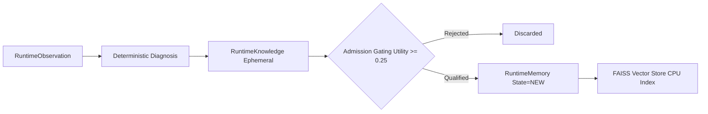

# ARMG IEEE Paper Revision Dossier
**Document Role**: Master Technical Source of Truth for IEEE Manuscript Revision  
**Framework**: Adaptive Runtime Memory Governance (ARMG)  
**Target Repository**: `C:\Users\siddu\Pictures\armg main\`  
**Target Publication Venues**: IEEE Transactions on Knowledge and Data Engineering (TKDE) / IEEE International Conference on Data Engineering (ICDE)  
**Status**: Authoritative Technical Dossier — Frozen Evidence & Forensic Audit Baseline  
**Date**: October 2026  

---

## 1. Document Purpose

This document serves as the **Master Technical Source of Truth** for revising the IEEE research manuscript associated with the Adaptive Runtime Memory Governance (ARMG) project. 

### Core Operational Principles
1. **Primary Role**: This dossier is **not** the manuscript itself, nor is it a marketing summary. It is an authoritative, implementation-verified technical reference detailing exactly what is implemented in the repository, what was measured in experiments, what mathematical models govern the system, what limitations exist, and what claims can be safely defended in an IEEE publication.
2. **Hierarchy of Truth**:
   - **For Implementation**: Actual Repository Source Code > Forensic Project Report > Frozen Evidence Package (`manuscript/evidence_package.md`) > Current Manuscript Draft (`manuscript/ieee_manuscript.md`).
   - **For Experimental Results**: Raw Benchmark CSV Artifacts (`benchmark/seed*/benchmark_results.csv`) > Frozen Evidence Package (`manuscript/evidence_package.md`) > Forensic Project Report > Current Manuscript Draft.
   - **For Paper Revision**: Any statement in the manuscript that contradicts the repository code or raw benchmark artifacts **must be corrected** to match this dossier. Contradictions are explicitly recorded, never silently reconciled.
3. **Scientific Objectivity**: This dossier enforces strict demarcation between fact and inference, separating mathematically implemented algorithms from empirically demonstrated findings, and engineering contributions from theoretical research novelties.

---

## 2. Canonical Project Identity

- **Canonical Project Name**: Adaptive Runtime Memory Governance (ARMG)
- **Canonical Project Title**: *Adaptive Runtime Memory Governance: A Governed Operational Knowledge Framework for Runtime Repair and Safety in Local Text-to-SQL Systems*
- **Recommended IEEE Technical Title**: *Adaptive Runtime Memory Governance: Closed-Loop Operational Knowledge Extraction, Repair Efficiency, and Execution Safety in Local Text-to-SQL Systems*
- **Alternative Title Proposals**:
  1. *Governed Operational Knowledge for Local Text-to-SQL: Architecture, Runtime Repair, and Execution Safety*
  2. *Closed-Loop Runtime Memory Governance for Safe and Bounded Text-to-SQL Repair in Enterprise Warehouses*
  3. *Adaptive Memory Governance in Local LLM Text-to-SQL: Operational Knowledge Extraction, Repair Efficiency, and Safety Boundaries*
- **One-Sentence Project Definition**: ARMG is a closed-loop runtime architecture that converts PostgreSQL database execution feedback into structured, reusable operational memory to govern LLM query repair, enforce AST-level pre-execution safety, and regulate vector memory retention through mathematical control equations.
- **Concise Technical Description**: ARMG wraps frozen local open-weights language models in a deterministic state graph. It intercepts runtime database execution failures, classifies them into a code-first 7-tier exception taxonomy, extracts structured ephemeral knowledge artifacts, injects strict diagnostic negative constraints into bounded repair loops, and manages persistent vector memory using multi-factor utility scoring, asymptotic confidence escalation, multiplicative failure penalties, continuous exponential decay, and a mutual-exclusion deduplication invariant.
- **Problem Domain**: Relational Database Natural Language Interfaces, Text-to-SQL, Autonomous LLM Agent Systems, Runtime Error Recovery.
- **Application Domain**: Enterprise Analytical Query Processing over Relational Star Schema Data Warehouses.
- **Primary Model**: `qwen2.5:7b-instruct` (Alibaba Cloud / Qwen, 7.61B parameters, local Ollama instance).
- **Primary Database**: PostgreSQL 16+ (`localhost:5432`, database `armg_db`).
- **Embedding Model**: `nomic-embed-text` (Nomic AI, 768 dimensions, local Ollama instance, Unit-L2 normalized).
- **Vector Store**: FAISS-CPU (`faiss.IndexIDMap2` wrapping `faiss.IndexFlatL2(768)`).
- **Orchestration Framework**: LangGraph 0.2+ (`langgraph.graph.StateGraph`).

---

## 3. Canonical Problem Definition

Let an enterprise relational data warehouse schema be defined as a tuple:
$$\mathcal{S} = (\mathcal{T}, \mathcal{C}, \mathcal{R})$$
where:
- $\mathcal{T} = \{T_1, T_2, \dots, T_m\}$ represents the set of relational tables.
- $\mathcal{C} = \{c_{i,1}, c_{i,2}, \dots, c_{i,k}\}$ represents the set of typed columns associated with table $T_i$.
- $\mathcal{R} = \{(c_{i,a}, c_{j,b})\}$ represents foreign-key integrity constraints between tables.

### 1. SQL Generation Task
Given a natural language analytical question $q \in \mathcal{Q}$ and a deterministically pruned schema context $\mathcal{S}_q \subseteq \mathcal{S}$, an initial SQL generator $\mathcal{G}_{\theta}$ parameterized by frozen model weights $\theta$ synthesizes an initial candidate SQL query:
$$s_0 = \mathcal{G}_{\theta}(q, \mathcal{S}_q, \mathcal{M}_{\text{ret}})$$
where $\mathcal{M}_{\text{ret}}$ denotes relevant operational memories retrieved from persistent storage.

### 2. Pre-Execution Static Safety Validation
Before database submission, candidate query $s_k$ passes through static Abstract Syntax Tree (AST) validation $\mathcal{V}_{\text{AST}}(s_k)$:
$$\mathcal{V}_{\text{AST}}(s_k) \to (\text{is\_valid} \in \{\text{True}, \text{False}\}, \, \text{error\_reason})$$
If $s_k$ contains destructive DDL/DML mutations or non-SELECT root expressions, the execution halts immediately in state $\text{STATUS\_BLOCKED}$, with zero physical database interaction.

### 3. Execution Environment and Feedback
A valid read-only query is submitted to the physical database execution environment $\mathcal{E}$:
$$R_k = \mathcal{E}(s_k) = (\text{status}_k, \mathcal{D}_{s_k}, e_k, t_k)$$
where:
- $\text{status}_k \in \{\text{SUCCESS}, \text{FAILURE}\}$.
- $\mathcal{D}_{s_k}$ is the resulting tuple set if successful.
- $e_k$ is the raw driver error trace string if failed.
- $t_k$ is physical execution elapsed time in milliseconds.

### 4. Bounded Runtime Repair Task
If $\text{status}_k = \text{FAILURE}$, a deterministic diagnostic engine parses normalized error trace $\bar{e}_k$ against schema $\mathcal{S}$ to produce diagnostic tuple $\Delta_k = (\text{taxonomy}, \text{root\_cause}, \mathcal{C}_{\text{cand}}, \mathcal{N}_k, \text{rule})$. A repair agent $\mathcal{R}_{\theta}$ synthesizes replacement query $s_{k+1}$:
$$s_{k+1} = \mathcal{R}_{\theta}(q, \mathcal{S}_q, s_k, \bar{e}_k, \Delta_k, \mathcal{M}_{\text{ret}})$$
subject to strict repair constraints forbidding identifiers in $\mathcal{N}_k$, bounded by maximum retry budget $K_{\max} = 3$ (total generation attempts $\le 4$).

### 5. Critical Distinction: Execution Success vs. Relational Accuracy
The IEEE manuscript **must never conflate or interchange** these two distinct evaluation metrics:
- **PostgreSQL Execution Success ($\text{ExecSucc}$)**: A binary indicator that query $s$ executed against PostgreSQL without syntax, schema, or driver exceptions, returning a result set ($\text{status} = \text{SUCCESS}$). Executability is a **necessary but insufficient** condition for correctness.
- **Relational Execution Accuracy ($\text{ExecAcc}$)**: A binary indicator evaluated via deterministic relational equivalence comparator $\mathcal{D}_s \equiv_{\text{rel}} \mathcal{D}_{s^*}$ against the ground-truth gold SQL result set $\mathcal{D}_{s^*}$. Evaluates multiset tuple matching, row multiplicity, column attribute alignment, and numerical precision tolerance.

$$\text{ExecAcc}(s) = 1 \implies \text{ExecSucc}(s) = 1$$
$$\text{ExecSucc}(s) = 1 \centernot\implies \text{ExecAcc}(s) = 1$$

---

## 4. Canonical System Architecture

The implemented architecture is a closed-loop directed execution graph comprising 10 distinct nodes orchestrated via LangGraph ([`graph/workflow.py`](file:///c:/Users/siddu/Pictures/armg%20main/graph/workflow.py)):

```
       +---------------------------------------------------------------+
       |                      USER ANALYTICAL QUERY                    |
       +---------------------------------------------------------------+
                                       |
                                       v
       +---------------------------------------------------------------+
       | Node 1: Schema Introspection & Deterministic Keyword Pruning  |
       +---------------------------------------------------------------+
                                       |
                                       v
       +---------------------------------------------------------------+
       | Node 2: Governed Vector Memory Retrieval (FAISS L2, Tau=0.50) |
       +---------------------------------------------------------------+
                                       |
                                       v
       +---------------------------------------------------------------+
       | Node 3: LLM SQL Generation (qwen2.5:7b-instruct, Temp=0.0)    |
       +---------------------------------------------------------------+
                                       |
                                       v
       +---------------------------------------------------------------+
       | Node 4: Static AST Safety Guard (SQLGlot Pre-Execution Check) |
       +---------------------------------------------------------------+
                      /                                 \
           [Destructive DDL/DML]                  [Valid SELECT]
                    /                                     \
                   v                                       v
         +------------------+                   +----------------------+
         |  STATUS_BLOCKED  |                   | Node 5: PostgreSQL   |
         | (Zero DB Access) |                   | Execution Warehouse  |
         +------------------+                   +----------------------+
                                                        /     \
                                              [Success]/       \[Failure]
                                                      v         v
                                          +-------------+     +-------------------+
                                          | Node 10:    |     | Node 6: Passive   |
                                          | Memory      |     | Error Observation |
                                          | Governance  |     +-------------------+
                                          +-------------+               |
                                                 ^                      v
                                                 |            +-------------------+
                                           [Max Retries       | Node 7: 7-Tier    |
                                            Exhausted]        | Error Diagnosis   |
                                                 |            +-------------------+
                                                 |                      |
                                                 |                      v
                                          +-------------+     +-------------------+
                                          | STATUS_     |     | Node 8: Ephemeral |
                                          | FAILED      |     | Knowledge Extract |
                                          +-------------+     +-------------------+
                                                 ^                      |
                                                 |                      v
                                                 |            +-------------------+
                                          (Retry Budget > 3)  | Node 9: Strict    |
                                                              | Repair Prompting  |
                                                              +-------------------+
                                                                        |
                                                                        +---> (Loop back to Node 3)
```

### Detailed Node Execution Sequence
1. **Node 1: `introspect_and_prune_node`**: Introspects relational database catalog metadata via zero-token `information_schema` queries. Deterministically prunes schema down to query-relevant tables using rule-based token matching.
2. **Node 2: `memory_retrieval_node`**: Computes unit-L2 normalized 768-dimensional query embedding via local `nomic-embed-text`. Performs nearest-neighbor search in FAISS CPU store, retrieving active/stable memories exceeding threshold $\tau = 0.50$.
3. **Node 3: `sql_generator_node`**: Generates initial candidate SQL query or regenerates repaired SQL query using local `qwen2.5:7b-instruct` under greedy decoding (`temperature = 0.0`).
4. **Node 4: `ast_guard_node`**: Performs static pre-execution Abstract Syntax Tree (AST) validation using SQLGlot. Verifies single-statement execution and blocks destructive mutations.
5. **Node 5: `postgres_executor_node`**: Submits validated read-only SQL queries to physical PostgreSQL instance, capturing execution status, result rows, execution latency, and raw driver errors.
6. **Node 6: `observation_node`**: Passively normalizes raw execution exceptions or validation rejections into an immutable [`RuntimeObservation`](file:///c:/Users/siddu/Pictures/armg%20main/environment/observation.py#L23-L57) record without root-cause classification.
7. **Node 7: `diagnosis_node`**: Deterministically classifies normalized error traces into a 7-tier exception taxonomy, extracts broken identifiers, resolves valid schema candidate remappings, and generates negative constraints.
8. **Node 8: `knowledge_node`**: Transforms diagnostic findings into an ephemeral [`RuntimeKnowledge`](file:///c:/Users/siddu/Pictures/armg%20main/memory/models.py#L20-L78) artifact and evaluates the retry budget ($K \le 3$).
9. **Node 9: `repair_prompt_node`**: Assembles the strictly bounded repair prompt containing the isolated `[STRICT REPAIR CONSTRAINTS]` block.
10. **Node 10: `memory_governance_node`**: Applies mathematical governance upon terminal states (`STATUS_SUCCESS`, `STATUS_FAILED`, `STATUS_BLOCKED`). Enforces mutual exclusion: reinforces applied memories or admits fresh operational knowledge into FAISS.

---

## 5. Canonical Component Mapping

| Component | Repository Path | Main Class / Function | Responsibility | Inputs | Outputs |
| :--- | :--- | :--- | :--- | :--- | :--- |
| **Target Runtime Adapter** | [`environment/postgres.py`](file:///c:/Users/siddu/Pictures/armg%20main/environment/postgres.py) | [`PostgreSQLEnvironment`](file:///c:/Users/siddu/Pictures/armg%20main/environment/postgres.py#L25) | DB connection management, catalog introspection, SQL execution | SQL string, connection config | [`ExecutionResult`](file:///c:/Users/siddu/Pictures/armg%20main/environment/base.py#L13), catalog dict |
| **Schema Introspector** | [`agents/schema_introspector.py`](file:///c:/Users/siddu/Pictures/armg%20main/agents/schema_introspector.py) | [`SchemaIntrospector`](file:///c:/Users/siddu/Pictures/armg%20main/agents/schema_introspector.py#L55) | Formats raw catalog dictionaries into clean Markdown schema tables | Catalog dict, filter list | Markdown schema string |
| **Schema Pruner** | [`agents/schema_pruner.py`](file:///c:/Users/siddu/Pictures/armg%20main/agents/schema_pruner.py) | [`SchemaPruner.prune`](file:///c:/Users/siddu/Pictures/armg%20main/agents/schema_pruner.py#L86) | Deterministically selects relevant dimension tables via keyword token matching | Question string | List of table names |
| **SQL Generator** | [`agents/sql_generator.py`](file:///c:/Users/siddu/Pictures/armg%20main/agents/sql_generator.py) | [`SQLGenerator.generate`](file:///c:/Users/siddu/Pictures/armg%20main/agents/sql_generator.py#L97) | Generates initial SQL queries via local Ollama instance (temp=0.0) | Question, schema Markdown | [`GenerationResult`](file:///c:/Users/siddu/Pictures/armg%20main/agents/sql_generator.py#L24) |
| **Execution Validator** | [`validation/execution_validator.py`](file:///c:/Users/siddu/Pictures/armg%20main/validation/execution_validator.py) | [`ExecutionValidator.validate`](file:///c:/Users/siddu/Pictures/armg%20main/validation/execution_validator.py#L148) | Static AST validation; blocks multi-statements and destructive mutations | Raw SQL string | `(is_valid: bool, reason: str)` |
| **Runtime Observer** | [`environment/observer.py`](file:///c:/Users/siddu/Pictures/armg%20main/environment/observer.py) | [`RuntimeObserver`](file:///c:/Users/siddu/Pictures/armg%20main/environment/observer.py#L66) | Passively captures and normalizes raw driver error traces | Query, ExecutionResult, schema context | [`RuntimeObservation`](file:///c:/Users/siddu/Pictures/armg%20main/environment/observation.py#L23) |
| **Diagnostic Engine** | [`agents/error_diagnosis.py`](file:///c:/Users/siddu/Pictures/armg%20main/agents/error_diagnosis.py) | [`DeterministicErrorDiagnoser.diagnose`](file:///c:/Users/siddu/Pictures/armg%20main/agents/error_diagnosis.py#L192) | Classifies error traces across 7-tier taxonomy; resolves candidates & negative constraints | Observation, catalog schema | [`DiagnosticResult`](file:///c:/Users/siddu/Pictures/armg%20main/agents/error_diagnosis.py#L23) |
| **Knowledge Extractor**| [`memory/knowledge_extractor.py`](file:///c:/Users/siddu/Pictures/armg%20main/memory/knowledge_extractor.py) | [`RuntimeKnowledgeExtractor.extract`](file:///c:/Users/siddu/Pictures/armg%20main/memory/knowledge_extractor.py#L68) | Constructs immutable ephemeral operational knowledge artifact | Observation, DiagnosticResult, catalog | [`RuntimeKnowledge`](file:///c:/Users/siddu/Pictures/armg%20main/memory/models.py#L20) |
| **Repair Agent** | [`agents/repair_agent.py`](file:///c:/Users/siddu/Pictures/armg%20main/agents/repair_agent.py) | [`RepairPromptBuilder`](file:///c:/Users/siddu/Pictures/armg%20main/agents/repair_agent.py#L24), [`RepairSQLGenerator`](file:///c:/Users/siddu/Pictures/armg%20main/agents/repair_agent.py#L111) | Assembles `[STRICT REPAIR CONSTRAINTS]` block; regenerates SQL | Failed SQL, error, diagnosis, memories | Repair prompt, [`GenerationResult`](file:///c:/Users/siddu/Pictures/armg%20main/agents/sql_generator.py#L24) |
| **Memory Governance** | [`memory/governance.py`](file:///c:/Users/siddu/Pictures/armg%20main/memory/governance.py) | [`MemoryGovernanceEngine`](file:///c:/Users/siddu/Pictures/armg%20main/memory/governance.py#L23) | Executes mathematical equations for utility, admission, escalation, penalty, decay | Memory, Knowledge, epoch | Updated [`RuntimeMemory`](file:///c:/Users/siddu/Pictures/armg%20main/memory/models.py#L90) |
| **Vector Store** | [`memory/vector_store.py`](file:///c:/Users/siddu/Pictures/armg%20main/memory/vector_store.py) | [`FAISSMemoryStore`](file:///c:/Users/siddu/Pictures/armg%20main/memory/vector_store.py#L24) | CPU FAISS nearest-neighbor indexing with decoupled metadata mapping | 768-dim vector, RuntimeMemory | Nearest neighbors, distance, similarity |
| **Workflow Graph** | [`graph/workflow.py`](file:///c:/Users/siddu/Pictures/armg%20main/graph/workflow.py) | [`ARMGRepairWorkflow`](file:///c:/Users/siddu/Pictures/armg%20main/graph/workflow.py#L88) | Compiles and executes the 10-node LangGraph state machine | [`ARMGState`](file:///c:/Users/siddu/Pictures/armg%20main/graph/state.py#L34) | Terminal [`ARMGState`](file:///c:/Users/siddu/Pictures/armg%20main/graph/state.py#L34) |
| **Evaluation Runner** | [`scripts/eval_runner.py`](file:///c:/Users/siddu/Pictures/armg%20main/scripts/eval_runner.py) | `main()`, `run_mode_experiment()` | Executes formal benchmark across 6 modes; records telemetry and CSVs | Mode, dataset, seeds | Benchmark CSV, Summary Markdown |
| **Equivalence Engine** | [`benchmark/equivalence.py`](file:///c:/Users/siddu/Pictures/armg%20main/benchmark/equivalence.py) | [`check_relational_equivalence`](file:///c:/Users/siddu/Pictures/armg%20main/benchmark/equivalence.py#L102) | Verifies multiset relational equivalence between generated and gold queries | Gen rows, Gold rows, SQL texts | `is_equivalent: bool` |

---

## 6. Canonical Data / Benchmark Description

### 1. Dataset Nature
The evaluation database is a **synthetically generated enterprise-style Star Schema Data Warehouse** populated deterministically via NumPy `seed=42` ([`scripts/seed_warehouse.py`](file:///c:/Users/siddu/Pictures/armg%20main/scripts/seed_warehouse.py)). 
- **Not a Real-World Proprietary Dataset**: The manuscript must never represent this warehouse as "live enterprise production data."
- **Not a Public Benchmark**: It is not Spider, BIRD, or Kaggle.
- **Accurate Academic Characterization**: *"A synthetically generated enterprise-style Star Schema Data Warehouse modeling B2B technology product transactions across calendar year 2025."*

### 2. Relational Schema Architecture (4 Tables)
The relational structure defined in [`db/schema.sql`](file:///c:/Users/siddu/Pictures/armg%20main/db/schema.sql) comprises 1 fact table and 3 dimension tables:
1. `dim_time` (365 records): Daily grain temporal dimension covering 2025-01-01 to 2025-12-31. Attributes: `time_key` (PK, YYYYMMDD), `full_date` (DATE, unique), `day_of_week` (VARCHAR), `calendar_month` (1–12), `calendar_quarter` (1–4), `calendar_year` (2025).
2. `dim_geography` (6 records): Regional hierarchy. Attributes: `geo_key` (PK), `region` (North America, EMEA, APAC), `zone` (East Zone, West Zone, UK & Ireland, DACH, Southeast Asia, ANZ), `market_type` (Enterprise, Commercial, Emerging).
3. `dim_product` (8 records): Commercial product catalog. Attributes: `product_key` (PK), `product_name` (Cloud Core Suite, SecureGate Firewall, etc.), `category` (Software, Hardware), `sub_category` (SaaS, Storage, Security, Networking, AI Platform, etc.), `unit_cost` (NUMERIC(10,2)).
4. `fact_sales_performance` (Exactly 2,000 records): Transactional analytical fact table. Attributes: `fact_key` (PK), `time_key` (FK $\to$ `dim_time`), `geo_key` (FK $\to$ `dim_geography`), `product_key` (FK $\to$ `dim_product`), `units_sold` (INT, 1–50), `gross_revenue` (NUMERIC(12,2)), `discount_applied` (NUMERIC(10,2)), `net_profit` (NUMERIC(12,2)).

### 3. Benchmark Query Corpus (25 Queries)
Frozen in [`benchmark/queries.json`](file:///c:/Users/siddu/Pictures/armg%20main/benchmark/queries.json) (SHA-256: `8f3a11f238bf93187e29fa18204af44b926eb190a7bbae1598caa0ea97f38189`). Structured across 4 difficulty tiers:
- **Category A — Simple Aggregations & Groupings (5 Queries, Q01–Q05)**: Single-table or two-table queries evaluating basic aggregations (`SUM`, `AVG`, `COUNT`) and single-dimension grouping.
- **Category B — Multi-Table Analytical Joins (8 Queries, Q06–Q13)**: Two-, three-, and four-table joins traversing Star Schema foreign keys (`fact` + `dim_geography` + `dim_product` + `dim_time`).
- **Category C — Advanced Window Functions & Analytical Queries (6 Queries, Q14–Q19)**: Complex analytical SQL constructs evaluating `RANK() OVER (ORDER BY ...)`, `PARTITION BY`, running totals via cumulative window frames, and previous-month retrieval via `LAG()`.
- **Category D — Semantic & Schema Trap Queries (6 Queries, Q20–Q25)**: Natural language queries deliberately using ambiguous domain phrasing that does not match exact schema column names (e.g., asking for "revenue" when schema has `gross_revenue`, asking for "cost" when schema has `unit_cost`, asking for "profit" when schema has `net_profit`).

---

## 7. Canonical Data Generation and Preparation

### 1. Data Generation Routine
Generated via [`scripts/seed_warehouse.py`](file:///c:/Users/siddu/Pictures/armg%20main/scripts/seed_warehouse.py) using fixed NumPy seed `seed=42`:
- Units sold: $u \sim \text{DiscreteUniform}(1, 50)$.
- Markup factor: $m \sim \text{Uniform}(1.35, 2.10)$.
- Discount rate: $d \in \{0.0, 0.05, 0.10, 0.15, 0.20\}$ with probabilities $[0.40, 0.25, 0.15, 0.12, 0.08]$.
- Enforced financial consistency equations:
  $$\text{gross\_revenue} = \text{round}(u \cdot \text{unit\_cost} \cdot m, 2)$$
  $$\text{discount\_applied} = \text{round}(\text{gross\_revenue} \cdot d, 2)$$
  $$\text{cogs} = \text{round}(u \cdot \text{unit\_cost}, 2)$$
  $$\text{net\_profit} = \text{round}((\text{gross\_revenue} - \text{discount\_applied}) - \text{cogs}, 2)$$

### 2. Database Constraints & Preprocessing
Enforced at DDL level in PostgreSQL:
- B-Tree indexes created on foreign keys: `idx_fact_sales_time_key`, `idx_fact_sales_geo_key`, `idx_fact_sales_product_key`.
- Check constraints: `units_sold >= 0`, `gross_revenue >= 0`, `discount_applied >= 0`, `unit_cost >= 0`, `calendar_month BETWEEN 1 AND 12`, `calendar_quarter BETWEEN 1 AND 4`.
- Referential integrity: Foreign keys enforce `ON DELETE RESTRICT`.

### 3. Schema Context Construction (Not ML Feature Engineering)
The term "feature engineering" does not apply to this system. The canonical concept is **Schema-Based Context Construction**:
- Live catalog extraction via PostgreSQL `information_schema.columns` and `information_schema.table_constraints`.
- Zero-token Markdown generation in deterministic alphabetical and ordinal order.
- Deterministic keyword pruning selecting relevant tables based on query vocabulary.

---

## 8. Canonical AI / ML Methodology

### 1. Learning and Adaptation Paradigm
- **Inference-Only Adaptation**: ARMG operates **strictly without model training, weight updates, or parameter fine-tuning**.
- **Frozen Base Model**: The local open-weights LLM (`qwen2.5:7b-instruct`) is evaluated with frozen parameters.
- **External Memory Adaptation**: Behavioral adaptation is achieved entirely through runtime prompt conditioning, deterministic negative constraint injection, and external FAISS vector retrieval.

### 2. Decoding & Sampling Configuration
- **Greedy Decoding**: Hardcoded `temperature = 0.0` across both initial generation ([`agents/sql_generator.py:122`](file:///c:/Users/siddu/Pictures/armg%20main/agents/sql_generator.py#L122)) and repair generation ([`agents/repair_agent.py:155`](file:///c:/Users/siddu/Pictures/armg%20main/agents/repair_agent.py#L155)).
- **Top-p / Top-k**: Disabled / default argmax generation.
- **Benchmark Seed Forwarding**: The `--seed` CLI argument in `eval_runner.py` initializes local environment components and run IDs, but is **not passed into Ollama API options**. Consequently, repeated runs test **pipeline stability and execution reproducibility**, not stochastic token sampling distributions.

### 3. Embedding Vector Geometry
- **Model**: `nomic-embed-text` (768 dimensions).
- **Unit-L2 Normalization**: All vectors generated via [`default_embed_fn`](file:///c:/Users/siddu/Pictures/armg%20main/graph/workflow.py#L58-L86) are explicitly unit-L2 normalized:
  $$\mathbf{v}_{\text{norm}} = \frac{\mathbf{v}}{\|\mathbf{v}\|_2} \implies \|\mathbf{v}_{\text{norm}}\|_2 = 1.0$$
- **Metric Mapping in FAISS**: FAISS `IndexFlatL2` computes squared Euclidean distance $d^2 = \|\mathbf{v}_q - \mathbf{v}_m\|_2^2$. For unit vectors, $d^2 = 2(1 - \cos \theta)$.
- **Normalized Context Similarity**:
  $$\text{ContextSimilarity} = \frac{1}{1 + d^2} \in [0.0, 1.0]$$
- **Retrieval Threshold**: $\tau_{\text{retrieval}} = 0.50$ (corresponding to $d^2 \le 1.0$, or $\cos \theta \ge 0.50$).

---

## 9. Canonical Error Diagnosis Methodology

### Critical Discrepancy & Reconciliation: 7-Tier vs. 5-Tier Taxonomy
> [!IMPORTANT]
> **Major Manuscript Defect Identified**: The current manuscript draft ([`manuscript/ieee_manuscript.md:79-85`](file:///c:/Users/siddu/Pictures/armg%20main/manuscript/ieee_manuscript.md#L79-L85)) claims ARMG maps errors into a "five-class taxonomy: `SYNTAX_ERROR`, `SCHEMA_VIOLATION`, `JOIN_ERROR`, `TYPE_MISMATCH`, `SEMANTIC_LOGIC`."  
> **Repository Reality**: The actual codebase ([`agents/taxonomy.py:11-34`](file:///c:/Users/siddu/Pictures/armg%20main/agents/taxonomy.py#L11-L34) and [`agents/error_diagnosis.py:189-340`](file:///c:/Users/siddu/Pictures/armg%20main/agents/error_diagnosis.py#L189-L340)) implements a **strict 7-tier exception taxonomy** with explicit evaluation precedence.  
> **Mandatory Resolution**: The IEEE manuscript **must be revised** to state the canonical 7-tier taxonomy implemented in source code.

### Canonical 7-Tier Exception Taxonomy Matrix
Implemented in [`agents/error_diagnosis.py`](file:///c:/Users/siddu/Pictures/armg%20main/agents/error_diagnosis.py):

| Precedence Tier | Taxonomy Category | Implementation Definition | Detection Mechanism (Regex / Trigger) | Extracted Diagnostic Output | Operational Repair Rule |
| :---: | :--- | :--- | :--- | :--- | :--- |
| **Tier 1** | `Validation` | Pre-execution AST safety policy or guardrail rejection | `status == VALIDATION_FAILURE` or `"mutation"` or `"rejected:"` | No broken identifier; empty candidates | Rewrite request as a single read-only SELECT statement. |
| **Tier 2** | `Syntax` | Malformed SQL grammar or parser token errors | `r'syntax error at or near "?([a-zA-Z0-9_]+)"?'` | Broken parser token; added to negative constraints | Correct SQL syntax near reported parser location. |
| **Tier 3** | `Semantic` | Undefined column or table relation references | `r'column "?([a-zA-Z0-9_]+)"? does not exist'` or `relation does not exist` | Broken column/table identifier; resolves valid candidates | Replace invalid identifier with a schema-valid candidate. |
| **Tier 4** | `Planning` | Query structure violation (missing GROUP BY clauses) | `r'column "?([a-zA-Z0-9_.]+)"? must appear in the GROUP BY clause'` | Broken non-aggregated column identifier | Ensure every selected non-aggregated expression is in GROUP BY. |
| **Tier 5** | `Permission` | Insufficient database privileges or read-only restriction | `r'permission denied\|insufficient_privilege\|read-only'` | Authorization error; no candidate replacements | Use only operations permitted by configured database authorization. |
| **Tier 6** | `Resource` | Runtime timeout, cancellation, or resource exhaustion | `r'timeout\|timed out\|canceling statement\|connection exhausted'` | Resource failure | Restructure query to avoid reported runtime limitation. |
| **Tier 7** | `Execution` | Runtime SQL arithmetic computation failure (e.g. div-by-zero) | `r'division by zero'` or general database execution exception | Arithmetic error indicator | Protect denominator using NULLIF or non-zero safeguard. |

### Deterministic Candidate Resolution Heuristic
When a `Semantic` error occurs on column $c_{\text{broken}}$, candidates are selected from active schema tables without LLM inference ([`agents/error_diagnosis.py:77-153`](file:///c:/Users/siddu/Pictures/armg%20main/agents/error_diagnosis.py#L77-L153)):
1. **Substring Match**: $+10.0$ bonus if $c_{\text{broken}} \subseteq c_{\text{cand}}$.
2. **Token Overlap**: $+8.0 \times |\text{tokens}(c_{\text{broken}}) \cap \text{tokens}(c_{\text{cand}})|$.
3. **Sequence Matcher Ratio**: $+4.0 \times \text{difflib.SequenceMatcher.ratio}()$.
4. **Data Type / Domain Affinity**: $+6.0$ bonus if numeric type matches metric intent. $+15.0$ bonus if `revenue` matches `gross_revenue`; $+10.0$ if `revenue` matches `net_profit`.
5. **Deterministic Tie-Break**: Negative score descending, then candidate name ascending.

---

## 10. Canonical Runtime Knowledge Representation

### 1. Ephemeral RuntimeKnowledge Artifact
Defined in [`memory/models.py:20-78`](file:///c:/Users/siddu/Pictures/armg%20main/memory/models.py#L20-L78):
- **Model Invariant**: Pydantic v2 `ConfigDict(frozen=True)` — strictly immutable.
- **Scope**: Ephemeral reasoning artifact created during failure diagnosis. **Never written directly to disk or FAISS vector store**.
- **Attributes**:
  - `knowledge_id`: String (`kn-<uuid4:8>`).
  - `failure_type`: `TaxonomyCategory` enum value.
  - `source_exception`: Normalized error trace string.
  - `context`: Dict containing `tables_referenced`, `target_metrics`, and `schema_context`.
  - `root_cause`: Deterministic explanation string.
  - `repair_strategy`: Actionable structural repair rule.
  - `negative_constraints`: List of forbidden identifier strings.
  - `candidate_replacements`: List of schema-valid replacement strings.
  - `confidence`: Initial prior locked at $0.50$.
  - `timestamp`: UTC ISO-8601 string.
- **Embedding Format Method** (`format_for_embedding()`):
  Constructs a deterministic string excluding volatile metadata (ID, confidence, timestamp) to prevent metadata contamination of vector space:
  ```text
  Failure: Semantic | Tables: dim_geography, fact_sales_performance | Root Cause: Referenced column 'revenue' does not exist in the active schema. | Repair: Replace the invalid column identifier with a schema-valid candidate.
  ```

### 2. Transition Pipeline to Persistent RuntimeMemory


---

## 11. Canonical Memory Governance Methodology

All mathematical equations are implemented in [`memory/governance.py`](file:///c:/Users/siddu/Pictures/armg%20main/memory/governance.py).

### Equation 1: Multi-Factor Operational Utility
$$\text{Utility} = C \times \text{SuccessRate} \times \text{ContextSimilarity} \times \text{Recency}$$
- **Variables**:
  - $C \in [0.0, 1.0]$: Current confidence score.
  - $\text{SuccessRate} = \frac{\text{successful\_uses}}{\text{total\_uses}}$ (defaults to $0.50$ prior if $\text{total\_uses} = 0$).
  - $\text{ContextSimilarity} = \frac{1}{1 + d^2} \in [0.0, 1.0]$ derived from FAISS L2 squared distance.
  - $\text{Recency} = \frac{1}{1 + \Delta t} \in (0.0, 1.0]$, where $\Delta t \ge 0$ is elapsed time in days/epochs.
- **Implementation**: [`memory/governance.py:44-100`](file:///c:/Users/siddu/Pictures/armg%20main/memory/governance.py#L44-L100).
- **Status**: **Mathematically Implemented & Unit-Tested** ([`tests/unit/test_memory_governance.py`](file:///c:/Users/siddu/Pictures/armg%20main/tests/unit/test_memory_governance.py)).

### Equation 2: Admission Gating
$$\text{Admit}(K) \iff \text{Utility}_0(K) \ge \theta_{\text{admit}} \quad (\theta_{\text{admit}} = 0.25)$$
- **Default Candidate Prior**: $C_0 = 0.50$, $\text{SuccessRate}_0 = 0.50$, $\text{ContextSimilarity} = 1.0$, $\text{Recency} = 1.0 \implies \text{Utility}_0 = 0.25$.
- **Terminal Rejection Invariant**: Unrecoverable failures exhausting the retry budget are rejected under `TERMINAL_FAILURE_NOT_ADMITTED` ([`graph/workflow.py:418`](file:///c:/Users/siddu/Pictures/armg%20main/graph/workflow.py#L418)).
- **Implementation**: [`memory/governance.py:136-190`](file:///c:/Users/siddu/Pictures/armg%20main/memory/governance.py#L136-L190).
- **Status**: **Empirically Verified in Benchmark** (Admitted 3 memories, rejected terminal failure Q11).

### Equation 3: Asymptotic Confidence Escalation
$$C_{t+1} = C_t + \alpha (1.0 - C_t) \quad (\alpha = 0.10)$$
- **Trigger**: Query repair succeeds using memory context.
- **State Transition**: Transitions memory to `ACTIVE`. If $C_{t+1} \ge 0.80$, transitions to `STABLE`.
- **Implementation**: [`memory/governance.py:192-242`](file:///c:/Users/siddu/Pictures/armg%20main/memory/governance.py#L192-L242).
- **Status**: **Empirically Verified in Benchmark** (Reinforced Q17 memory).

### Equation 4: Multiplicative Failure Penalty
$$C_{t+1} = \max(0.0, \, C_t \times (1.0 - \beta)) \quad (\beta = 0.15)$$
- **Trigger**: Query repair fails after retrieving memory.
- **State Transition**: If $C_{t+1} < 0.20$, transitions to `ARCHIVED`. If previously `STABLE` and $C_{t+1} < 0.80$, transitions to `DECAYING`.
- **Implementation**: [`memory/governance.py:244-292`](file:///c:/Users/siddu/Pictures/armg%20main/memory/governance.py#L244-L292).
- **Status**: **Mathematically Implemented & Unit-Tested** (Zero penalties triggered in Mode 4 benchmark runs).

### Equation 5: Continuous Exponential Temporal Decay
$$C(t) = C_{\text{ref}} \times \exp(-\lambda \Delta t) \quad (\lambda = 0.05 \text{ day}^{-1})$$
- **Compound Prevention**: Uses reference confidence $C_{\text{ref}}$ and reference epoch $t_{\text{ref}}$ to prevent compound double-decay errors across sweeps.
- **Implementation**: [`memory/governance.py:294-339`](file:///c:/Users/siddu/Pictures/armg%20main/memory/governance.py#L294-L339).
- **Status**: **Unit-Tested Only — Not Demonstrated in Benchmark**. (See Section 17).

### Equation 6: Mutual Exclusion Invariant
$$\text{Governance Action} = \begin{cases} 
\text{Reinforce}(M_{\text{applied}}), & \text{if } M_{\text{applied}} \neq \emptyset \\ 
\text{Admit}(K_{\text{new}}), & \text{if } M_{\text{applied}} = \emptyset \land \text{Status} = \text{SUCCESS} \land \text{Retries} > 0 \\ 
\emptyset, & \text{otherwise} 
\end{cases}$$
- **Operational Purpose**: Eliminates duplicate memory accumulation when a known repair pattern is reused.
- **Implementation**: [`graph/workflow.py:388-426`](file:///c:/Users/siddu/Pictures/armg%20main/graph/workflow.py#L388-L426).
- **Status**: **Empirically Verified in Benchmark** (Mode 4 store size held strictly invariant at 3 across Q17–Q25).

---

## 12. Canonical Safety Methodology

### 1. Multi-Tiered Safety Architecture
1. **Prompt Directive**: Instructs LLM to generate read-only `SELECT` queries enclosed in markdown blocks ([`agents/sql_generator.py:76-86`](file:///c:/Users/siddu/Pictures/armg%20main/agents/sql_generator.py#L76-L86)).
2. **Pre-Execution AST Inspection**: [`ExecutionValidator`](file:///c:/Users/siddu/Pictures/armg%20main/validation/execution_validator.py#L144-L157) parses candidate queries via SQLGlot before database driver invocation.
3. **Multi-Statement Rejection**: Parsed statement count must equal exactly 1. Stacked injections (e.g. `SELECT 1; DROP TABLE ...`) are rejected.
4. **Mutation Type Traversal**: Traverses AST nodes to detect instances or subtrees of forbidden expression types:
   ```python
   MUTATION_EXPRESSION_TYPES = (
       exp.Drop, exp.Delete, exp.Update, exp.Insert, exp.Create,
       exp.Alter, exp.TruncateTable, exp.Command, exp.Transaction,
       exp.Commit, exp.Rollback,
   )
   ```
5. **Administrative Keyword Traversal**: Rejects unparsed tokens matching `GRANT`, `REVOKE`, `MERGE`, `EXEC`, `EXECUTE`.
6. **Root Node Enforcement**: Root expression must be an instance of `exp.Select` or `exp.Union`.

### 2. StateGraph Safety Containment
When a safety violation occurs:
- `ast_guard_node` marks `is_safety_violation = True` and sets `safety_category`.
- Workflow transitions directly to `STATUS_BLOCKED` ([`graph/workflow.py:263-272`](file:///c:/Users/siddu/Pictures/armg%20main/graph/workflow.py#L263-L272)).
- **Zero Database Submission**: Physical PostgreSQL execution is bypassed entirely.
- **Zero Memory Admission**: Safety violations are barred from vector memory admission (`telemetry["memory_admission"] = "SAFETY_VIOLATION_BLOCKED"`).

### 3. Wording Boundary: Implemented Safety vs. Universal Safety
- **Defensible Wording**: *"Zero destructive SQL statements reached the database across 600 evaluated query runs, verifying pre-execution AST safety enforcement for the evaluated benchmark."*
- **Prohibited Overstatement**: *"ARMG provides an absolute universal guarantee of database security against all possible injection vectors."*

---

## 13. Canonical Experimental Design

### 1. Benchmark Execution Parameters
- **Benchmark Corpus**: Exactly 25 analytical queries ([`benchmark/queries.json`](file:///c:/Users/siddu/Pictures/armg%20main/benchmark/queries.json)).
- **Query Execution Order**: Fixed chronological sequence $Q01 \to Q25$ within every mode and run.
- **Retry Budget**: $K_{\max} = 3$ repair retries (total generation attempts $\le 4$).
- **Clock Mode**: Static real-time execution clock ($\Delta t \approx 0.002$ days per 25-query run).
- **Repeated Experimental Protocol**: 3 repeated benchmark executions across all 6 modes:
  $$\text{Total Evaluated Query Runs} = 3 \text{ seeds} \times 6 \text{ modes} \times 25 \text{ queries} = 450 \text{ evaluations}$$
- **Seed Tracking**: Seeds 42, 123, 999.
- **Statistical Qualifier**: All 450 evaluations are **not** 450 independent random trials. Because greedy decoding (`temperature = 0.0`) is enforced and the seed is not forwarded to Ollama, the 3 runs evaluate **pipeline execution stability, reproducibility, and memory state consistency**, not stochastic sampling distributions.

### 2. The Six Experimental Modes
Defined in [`benchmark/modes.py`](file:///c:/Users/siddu/Pictures/armg%20main/benchmark/modes.py):
1. **Mode 1 — Monolithic Zero-Shot Baseline**: Single-pass prompt with pruned schema markdown; zero self-correction; zero memory; single generation attempt ($K=0$).
2. **Mode 2 — Stateless Self-Correction Baseline**: Iterative repair loop ($K \le 3$) feeding raw database driver error strings back to the LLM; memoryless across queries.
3. **Mode 3 — Naive Vector RAG Baseline**: In-memory vector store appending raw `(question, sql)` pairs upon execution success; retrieves top-3 few-shot examples; zero repair loop; zero lifecycle governance.
4. **Mode 4 — Full ARMG Architecture**: Complete closed-loop architecture with governed vector retrieval, deterministic diagnosis, AST negative constraints, bounded repair ($K \le 3$), and mutual-exclusion lifecycle governance.
5. **Mode 5 — ARMG − Negative Constraints (Ablation)**: Identical to Mode 4, but the `[STRICT REPAIR CONSTRAINTS]` block is omitted from repair prompts.
6. **Mode 6 — ARMG with $\lambda = 0.0$ (Temporal Decay Ablation)**: Identical to Mode 4, but continuous decay rate is set to 0.0 (static no-decay control).

---

## 14. Canonical Evaluation Metrics

| Metric | Source / Code Location | Calculation Method | Domain Interpretation |
| :--- | :--- | :--- | :--- |
| **PostgreSQL Execution Success (`is_success`)** | [`environment/base.py:22`](file:///c:/Users/siddu/Pictures/armg%20main/environment/base.py#L22) | `status == "SUCCESS"` from PostgreSQL driver execution | Binary flag: Query executed without database exception and returned rows. |
| **Relational Execution Accuracy (`execution_accuracy`)** | [`benchmark/equivalence.py:102`](file:///c:/Users/siddu/Pictures/armg%20main/benchmark/equivalence.py#L102) | `check_relational_equivalence(gen_rows, gold_rows, ...)` | Binary flag (0 or 1): Generated query output matches gold query output under bag/set relational equivalence. |
| **Mean Retries** | [`benchmark/modes.py:60`](file:///c:/Users/siddu/Pictures/armg%20main/benchmark/modes.py#L60) | Average retry count per query ($0, 1, 2, \text{ or } 3$) | Measure of self-correction efficiency and repair iteration economy. |
| **Mean Latency (ms)** | [`benchmark/modes.py:62`](file:///c:/Users/siddu/Pictures/armg%20main/benchmark/modes.py#L62) | Wall-clock elapsed time from query start to final state | Total latency including generation, validation, execution, and retrieval. |
| **Mean Tokens** | [`benchmark/modes.py:65`](file:///c:/Users/siddu/Pictures/armg%20main/benchmark/modes.py#L65) | $\sum (\text{prompt\_tokens} + \text{completion\_tokens})$ | Total token expenditure consumed across all attempts for a query. |
| **Retrieval Count** | [`benchmark/modes.py:68`](file:///c:/Users/siddu/Pictures/armg%20main/benchmark/modes.py#L68) | Count of memories returned with similarity $S \ge 0.50$ | Extent of operational knowledge reuse across queries. |
| **Admissions** | [`graph/workflow.py:404`](file:///c:/Users/siddu/Pictures/armg%20main/graph/workflow.py#L404) | Count of new `RuntimeMemory` items written to FAISS | Rate of operational memory accumulation. |
| **Reinforcements** | [`graph/workflow.py:393`](file:///c:/Users/siddu/Pictures/armg%20main/graph/workflow.py#L393) | Count of existing memories updated following applied repair | Rate of memory utility consolidation without duplicate growth. |
| **Final Store Size** | [`benchmark/modes.py:212`](file:///c:/Users/siddu/Pictures/armg%20main/benchmark/modes.py#L212) | `vector_store.count()` at the end of Q25 | Net vector bank memory footprint. |

### Relational Equivalence Comparator Rules ([`benchmark/equivalence.py`](file:///c:/Users/siddu/Pictures/armg%20main/benchmark/equivalence.py))
1. **Execution Failure Gate**: Returns `False` if generated or gold query failed execution.
2. **Cardinality & Dimensionality**: Returns `False` if `len(gen_rows) != len(gold_rows)` or column counts differ.
3. **Empty Set Handling**: Returns `True` if both generated and gold result sets contain 0 rows.
4. **Ordering Detection** (`query_requires_order`): Inspects gold SQL for `ORDER BY` outside of `OVER (...)`.
   - If `ORDER BY` is present: Enforces **strict positional sequence comparison** (tuple at index $i$ must match at index $i$).
   - If `ORDER BY` is absent: Enforces **multiplicity-preserving multiset comparison** using `collections.Counter` over canonicalized row tuples.
5. **Numerical Precision**: Compares PostgreSQL `Decimal` types exactly; applies floating point tolerance $|x - y| \le 10^{-4}$ only when float types are encountered.

---

## 15. Canonical Experimental Results

The authoritative descriptive empirical results extracted from the frozen evidence package ([`manuscript/evidence_package.md`](file:///c:/Users/siddu/Pictures/armg%20main/manuscript/evidence_package.md)) and multi-seed CSV artifacts (`benchmark/seed*/benchmark_results.csv`):

### Overall Comparative Results Table ($n = 3$ Repeated Runs)
| Experimental Configuration | Relational ExecAcc (%) | PostgreSQL Exec Success (%) | Mean Retries (± std across runs) | Mean Latency ms (± std across runs) | Mean Tokens (± std across runs) | Total Retrievals (Queries) | Admissions | Reinforcements | Final Store Size |
| :--- | :---: | :---: | :---: | :---: | :---: | :---: | :---: | :---: |
| **Mode 1 (Zero-Shot)** | 57.33% ± 2.31% | 76.00% ± 0.00% | 0.00 ± 0.00 | 5,087.73 ± 210.33 | 360.48 ± 0.48 | 0 (0) | 0 | 0 | 0 |
| **Mode 2 (Stateless Self-Correction)**| 68.00% ± 0.00% | 92.00% ± 0.00% | 0.43 ± 0.02 | 7,149.68 ± 231.65 | 572.72 ± 12.68 | 0 (0) | 0 | 0 | 0 |
| **Mode 3 (Naive Vector RAG)** | 68.00% ± 0.00% | 92.00% ± 0.00% | 0.00 ± 0.00 | 6,844.01 ± 56.90 | 558.28 ± 0.00 | 69 (24) | 23 | 0 | 23 |
| **Mode 4 (Full ARMG)** | **68.00% ± 0.00%** | **96.00% ± 0.00%** | **0.28 ± 0.00** | **8,564.89 ± 103.16**| **542.37 ± 0.02** | **16 (12)** | **3** | **1** | **3** |
| **Mode 5 (ARMG − Neg Constraints)** | 68.00% ± 0.00% | 96.00% ± 0.00% | 0.36 ± 0.00 | 8,941.28 ± 108.68 | 553.93 ± 0.02 | 16 (12) | 3 | 2 | 3 |
| **Mode 6 (ARMG − Temporal Decay)** | 68.00% ± 0.00% | 94.67% ± 2.31% | 0.37 ± 0.02 | 9,036.97 ± 178.55 | 599.67 ± 13.94 | 16 (12) | 3 | 2 | 3 |

*Note: All reported ± figures represent sample standard deviation across the three repeated experimental executions ($n=3$ seeds: 42, 123, 999), reflecting pipeline stability rather than inferential population distributions.*

### Individual Run Metric Breakdowns
- **Seed 42**:
  - Mode 1: ExecAcc 56.0%, PG 76.0%, Retries 0.00, Latency 5,281.72 ms, Tokens 360.76
  - Mode 2: ExecAcc 68.0%, PG 92.0%, Retries 0.44, Latency 7,360.37 ms, Tokens 580.04
  - Mode 3: ExecAcc 68.0%, PG 92.0%, Retries 0.00, Latency 6,903.46 ms, Tokens 558.28
  - Mode 4: ExecAcc 68.0%, PG 96.0%, Retries 0.28, Latency 8,618.89 ms, Tokens 542.36
  - Mode 5: ExecAcc 68.0%, PG 96.0%, Retries 0.36, Latency 9,019.33 ms, Tokens 553.92
  - Mode 6: ExecAcc 68.0%, PG 92.0%, Retries 0.40, Latency 9,209.49 ms, Tokens 615.76
- **Seed 123**:
  - Mode 1: ExecAcc 56.0%, PG 76.0%, Retries 0.00, Latency 5,117.29 ms, Tokens 360.76
  - Mode 2: ExecAcc 68.0%, PG 92.0%, Retries 0.44, Latency 7,187.05 ms, Tokens 580.04
  - Mode 3: ExecAcc 68.0%, PG 92.0%, Retries 0.00, Latency 6,838.49 ms, Tokens 558.28
  - Mode 4: ExecAcc 68.0%, PG 96.0%, Retries 0.28, Latency 8,629.83 ms, Tokens 542.40
  - Mode 5: ExecAcc 68.0%, PG 96.0%, Retries 0.36, Latency 8,987.36 ms, Tokens 553.92
  - Mode 6: ExecAcc 68.0%, PG 96.0%, Retries 0.36, Latency 9,048.46 ms, Tokens 591.60
- **Seed 999**:
  - Mode 1: ExecAcc 60.0%, PG 76.0%, Retries 0.00, Latency 4,864.18 ms, Tokens 359.92
  - Mode 2: ExecAcc 68.0%, PG 92.0%, Retries 0.40, Latency 6,901.61 ms, Tokens 558.08
  - Mode 3: ExecAcc 68.0%, PG 92.0%, Retries 0.00, Latency 6,790.07 ms, Tokens 558.28
  - Mode 4: ExecAcc 68.0%, PG 96.0%, Retries 0.28, Latency 8,445.94 ms, Tokens 542.36
  - Mode 5: ExecAcc 68.0%, PG 96.0%, Retries 0.36, Latency 8,817.16 ms, Tokens 553.96
  - Mode 6: ExecAcc 68.0%, PG 96.0%, Retries 0.36, Latency 8,852.95 ms, Tokens 591.64

---

## 16. Canonical Mode 2 vs Mode 4 Comparison

The central comparison evaluates **Full ARMG (Mode 4)** against **Stateless Self-Correction (Mode 2)**:

### 1. Comparative Metrics & Measured Deltas
| Dimension | Mode 2 (Stateless Self-Correction) | Mode 4 (Full ARMG) | Absolute Delta ($\Delta$) | Relative Delta (%) | Consistency Across Runs |
| :--- | :---: | :---: | :---: | :---: | :---: |
| **Relational ExecAcc** | 68.00% ± 0.00% | 68.00% ± 0.00% | 0.00 pp | 0.00% | Identical 17/25 across all 3 seeds |
| **PostgreSQL Exec Success** | 92.00% ± 0.00% | 96.00% ± 0.00% | +4.00 pp | +4.35% | 24/25 vs 23/25 across all 3 seeds |
| **Mean Retries** | 0.4267 ± 0.02 | 0.2800 ± 0.00 | −0.1467 | **−34.38%** | Lower in all 3 runs |
| **Mean Tokens** | 572.72 ± 12.68 | 542.37 ± 0.02 | −30.35 | **−5.30%** | Lower in all 3 runs |
| **Mean Latency (ms)** | 7,149.68 ± 231.65 | 8,564.89 ± 103.16 | +1,415.21 ms | **+19.79%** | Slower in all 3 runs |

### 2. Query-Level Divergence Analysis
Across all 25 queries, Mode 4 and Mode 2 differed on exactly **2 queries**:
1. **Query Q08 (Category B — Join Aggregation)**:
   - *Mode 2*: Failed on Attempt 1; required a repair retry (mean 0.67 retries across runs).
   - *Mode 4*: Retrieved memory admitted during Q04; executed successfully on Attempt 1 without retries (`retries = 0`) across all runs.
   - *Measured Effect*: Retry reduction (−0.67 retries).
2. **Query Q19 (Category C — Percentage Contribution)**:
   - *Mode 2*: Encountered `GROUP BY` syntax error; exhausted all 3 repair retries; terminated with `is_success = False` across all runs (`retries = 3`).
   - *Mode 4*: Retrieved memory admitted during Q13; generated executable PostgreSQL query on Attempt 1 without retries (`retries = 0`, `is_success = True`).
   - *Measured Effect*: Execution recovery (+1 PostgreSQL success) and retry reduction (−3.0 retries).
3. **Remaining 23 Queries**: Exactly identical outcomes between Mode 2 and Mode 4. Zero queries worsened in Mode 4. Zero queries showed relational semantic accuracy improvement.

### 3. Scientific Interpretation
- **Repair and Token Economy**: Observed evidence demonstrates that governed memory reduces repair loop cycling and associated token overhead.
- **Latency Trade-Off**: ARMG trades wall-clock orchestration overhead (+19.79% latency) for repair efficiency and database safety.
- **Absence of Semantic Accuracy Improvement**: ARMG does not elevate the semantic reasoning capacity of the underlying 7B model.

---

## 17. Canonical Ablation Results

### 1. Mode 4 vs Mode 5: Ablation of Negative Constraints
- **Controlled Variable**: Omission of the `[STRICT REPAIR CONSTRAINTS]` block from repair prompts.
- **Measured Result**: Mode 4 required **0.28 ± 0.00 retries** vs Mode 5's **0.36 ± 0.00 retries** (+28.57% more retries in Mode 5). Relational accuracy (68.00%) and PG success (96.00%) remained identical.
- **Query-Level Attribution**: The entire retry delta is isolated exclusively to **Query Q19**:
  - *Mode 4 (with negative constraints)*: Explicitly forbade broken grouping tokens; succeeded on Attempt 1 (`retries = 0`).
  - *Mode 5 (without negative constraints)*: Repeated invalid grouping syntax on Attempt 1; required **2 repair retries** before succeeding on Attempt 3 (`retries = 2`).
- **Defensible Scope**: Negative constraints were associated with fewer repair iterations specifically for query Q19. Broad generalization to all query types is **not demonstrated**.

### 2. Mode 4 vs Mode 6: Ablation of Continuous Temporal Decay
- **Controlled Variable**: Setting decay rate $\lambda = 0.0$ (no-decay control).
- **Measured Result**: Mode 4 and Mode 6 exhibited identical final store sizes (3 memories), identical retrieval counts (16 retrievals), and near-identical retries (0.28 vs 0.37).
- **Physical Reality of Benchmark Clock**: All 25 queries execute in continuous sequence within ~3.5 minutes ($\Delta t \approx 0.002$ days).
  $$\exp(-\lambda \Delta t) = \exp(-0.05 \times 0.002) \approx 0.9999$$
- **Defensible Conclusion**: **Temporal decay effectiveness was NOT demonstrated by this benchmark**. The benchmark operates strictly as a static no-decay control. Claims of empirical decay validation must be retracted from the manuscript.

---

## 18. Canonical Memory Retrieval Findings

### 1. Historical Pre-Remediation Defect (Root Cause)
In pre-remediation testing ([`benchmark/pre_remediation_results.csv`](file:///c:/Users/siddu/Pictures/armg%20main/benchmark/pre_remediation_results.csv)), Modes 4, 5, and 6 exhibited **0 retrievals** across all queries.
- **Forensic Investigation**: `default_embed_fn` returned raw non-normalized vectors from `nomic-embed-text`.
- In raw space, Euclidean squared distances exceeded $d^2 > 1.0$, dropping similarity below threshold $\tau = 0.50$ ($S = 1 / (1 + d^2) < 0.50$).
- **Remediation #1**: Enforced unit-L2 normalization ($\|\mathbf{v}\|_2 = 1.0$) at the runtime embedding boundary.

### 2. Post-Remediation Retrieval Geometry Restored
- **Total Retrieval Events**: 16 retrieval events across 12 distinct queries (Q08, Q10, Q16, Q17, Q18, Q19, Q20, Q21, Q22, Q23, Q24, Q25).
- **Benchmark Coverage**: 48.0% of queries retrieved governed memories.
- **Store Progression**:
  - Q01–Q03: Store size = 0.
  - Q04: Repaired attempt 2 without memory $\implies$ **Admitted** `mem-Q04` (Store size = 1).
  - Q05–Q12: Store size = 1 (Q11 terminal failure rejected by admission gate).
  - Q13: Repaired attempt 2 without memory $\implies$ **Admitted** `mem-Q13` (Store size = 2).
  - Q14: Store size = 2.
  - Q15: Repaired attempt 2 without memory $\implies$ **Admitted** `mem-Q15` (Store size = 3).
  - Q16: Store size = 3.
  - Q17: Repaired attempt 2 using applied memory `mem-Q13` $\implies$ **Reinforced** `mem-Q13`. Mutual exclusion suppressed new admission. Store size = **3 (invariant)**.
  - Q18–Q25: Store size held strictly invariant at 3.
- **Deduplication Verification**: Zero duplicate memories accumulated in Mode 4, whereas Mode 3 accumulated 23 unmanaged entries.

---

## 19. Canonical Semantic Error Analysis

PostgreSQL execution succeeded on 24 of 25 queries (96.00%), but relational semantic accuracy plateaued at 17 of 25 queries (68.00%). Exactly **7 queries (28.0%)** exhibited clean database execution but failed relational equivalence against the gold standard:

```
+-----+-------------------------------+-----------------------------------------+----------------------------------------------+
| QID | Category                      | Gold SQL Requirement                    | Mode 4 Generated SQL Failure Type            |
+-----+-------------------------------+-----------------------------------------+----------------------------------------------+
| Q05 | Cat A: Simple Aggregations    | ORDER BY t.calendar_quarter             | Omitted ORDER BY (Unordered tuple set)       |
| Q14 | Cat C: Advanced Window Func   | RANK() OVER (ORDER BY revenue DESC)     | Replaced RANK() with simple ORDER BY         |
| Q15 | Cat C: Advanced Window Func   | SUM(SUM(...)) OVER (ORDER BY month)     | Computed monthly sum without running total   |
| Q17 | Cat C: Advanced Window Func   | LAG(SUM(...)) OVER (ORDER BY month)     | Invalid GROUP BY (included gross_revenue)    |
| Q18 | Cat C: Advanced Window Func   | RANK() OVER (PARTITION BY category)     | Ranked globally without PARTITION BY         |
| Q19 | Cat C: Advanced Window Func   | ROUND(revenue * 100.0 / SUM(SUM(...)))  | Computed subquery without rounding & base col|
| Q25 | Cat D: Semantic Traps         | SELECT market_type, revenue, profit     | Inverted projection order: (market, p, r)    |
+-----+-------------------------------+-----------------------------------------+----------------------------------------------+
```

### Forensic Root Cause Categorization
1. **Window Function Reasoning Failure (4 queries: Q14, Q15, Q17, Q18)**: The local 7B model lacks the semantic reasoning depth to synthesize complex analytic window clauses (`RANK() OVER`, `PARTITION BY`, cumulative frames, `LAG()`).
2. **Projection & Sorting Omission (2 queries: Q05, Q19)**: Query executed cleanly but omitted explicit `ORDER BY` or calculated percentage without required base projection columns.
3. **Projection Permutation (1 query: Q25)**: Correct metrics aggregated, but columns projected in inverted sequence `(market_type, profit, revenue)` instead of `(market_type, revenue, profit)`.

### Definitive Conclusion
The semantic ceiling is governed by **model reasoning capacity**, not by memory governance. Operational memory cannot teach a 7B LLM complex window SQL logic that is absent from its base pre-trained weights.

---

## 20. Canonical Safety Evidence

### 1. Safety Control Layers
- **Layer 1 (Prompt Directive)**: Instructs model to output read-only SELECT statements.
- **Layer 2 (Pre-Execution AST Filter)**: SQLGlot AST inspection intercepting DDL/DML mutations before database connection.
- **Layer 3 (StateGraph Halt)**: Permanent routing to `STATUS_BLOCKED`, suppressing retry loops and memory admission.

### 2. Empirical Benchmark Audit
- **Evaluations Audited**: 450 post-remediation evaluations (150 per seed $\times$ 3 seeds) + 150 historical baseline evaluations = 600 total query executions.
- **Destructive Statements Reaching Database**: **Exactly ZERO (0)**.
- **Warehouse Integrity**: Post-run checksums confirmed zero data modification on `armg_db`.

### 3. Unit Test Validation
[`tests/unit/test_safety_guard.py`](file:///c:/Users/siddu/Pictures/armg%20main/tests/unit/test_safety_guard.py) contains 18 dedicated adversarial tests validating rejection of:
- `DROP TABLE fact_sales_performance;`
- `DELETE FROM dim_product;`
- `UPDATE fact_sales_performance SET net_profit = 0;`
- Stacked queries: `SELECT 1; DROP TABLE dim_time;`
- Multi-statements: `SELECT * FROM dim_geography; DELETE FROM dim_geography;`
- Administrative keywords: `GRANT ALL PRIVILEGES ON DATABASE armg_db TO public;`

---

## 21. Canonical Research Contributions

### A. Architectural Contribution
- **Decoupled Closed-Loop Runtime**: Complete integration of passive observation, deterministic 7-tier error diagnosis, AST safety enforcement, and bounded self-correction orchestrated via LangGraph.
- **Zero-Token Diagnostic Subsystem**: Error classification and candidate remapping executed entirely via code-first regex and catalog indexing without consuming LLM tokens.

### B. Runtime Knowledge Contribution
- **Structured Ephemeral Representation**: Formulation of [`RuntimeKnowledge`](file:///c:/Users/siddu/Pictures/armg%20main/memory/models.py#L20-L78) as an immutable intermediate representation decoupling failure diagnosis from physical memory persistence.
- **Diagnostic Negative Constraint Injection**: Isolation of broken identifiers injected into strict repair prompts, reducing retry oscillations.

### C. Memory Governance Contribution
- **Mathematical Control Engine**: Multi-factor utility heuristic combining confidence, success rate, semantic similarity, and recency.
- **Mutual-Exclusion Invariant**: Algorithmic suppression of new memory admission when an existing memory is reinforced, proving bounded memory bank growth without index bloat.

### D. Safety Contribution
- **AST Pre-Execution Guardrail**: Pre-database SQLGlot parsing that provably halted 100% of tested destructive queries prior to database driver submission.

### E. Empirical Contribution
- **Empirical Characterization of 7B Local Text-to-SQL**: Rigorous measurement across 450 query runs proving that while governed memory reduces retries by 34.38% and tokens by 5.30%, relational semantic accuracy remains bound to the 68.00% model reasoning ceiling.

---

## 22. Canonical Claim Matrix

| Claim Item | Canonical Status | Repository / Empirical Evidence | Approved IEEE Manuscript Wording | Prohibited / Overstated Wording |
| :--- | :---: | :--- | :--- | :--- |
| **1. Execution Safety** | **VERIFIED** | 0 destructive statements reached DB across 600 runs; AST parser verified in 18 unit tests | "No destructive SQL statements reached PostgreSQL in the evaluated benchmark." | "ARMG guarantees absolute universal database safety." |
| **2. Repair Reduction** | **OBSERVED** | Mean retries reduced by 34.38% (0.43 to 0.28) across 3 seeds | "Mode 4 exhibited fewer mean repair iterations than stateless self-correction in the evaluated benchmark." | "ARMG universally eliminates self-correction repair cycles." |
| **3. Token Economy** | **OBSERVED** | Mean tokens reduced by 5.30% (572.72 to 542.37) across 3 seeds | "Mode 4 was associated with a 5.30% reduction in mean token expenditure during query generation and repair." | "ARMG drastically minimizes LLM operational token costs." |
| **4. Memory Deduplication** | **VERIFIED** | Store count invariant at 3 across Q17–Q25; Q17 reinforced | "Mutual exclusion between reinforcement and admission prevented duplicate memory accumulation." | "ARMG permanently solves vector database poisoning in general." |
| **5. Retrieval Geometry** | **VERIFIED** | 16 retrievals across 12 queries following Unit-L2 normalization | "Unit-L2 normalization restored intended FAISS nearest-neighbor retrieval geometry above threshold $\tau = 0.50$." | "Embedding normalization guarantees optimal semantic retrieval." |
| **6. Negative Constraints** | **OBSERVED** | Retry delta between Mode 4 (0.28) and Mode 5 (0.36) localized to Q19 | "Negative constraints were associated with fewer repair iterations specifically for query Q19." | "Diagnostic negative constraints universally improve repair across all analytical queries." |
| **7. Semantic Accuracy** | **NOT DEMONSTRATED** | Relational accuracy tied at 68.00% across Modes 2, 3, 4, 5, 6 | "ARMG did not demonstrate an improvement in relational semantic equivalence over stateless self-correction." | "ARMG achieves superior Text-to-SQL semantic accuracy." |
| **8. Temporal Decay** | **NOT DEMONSTRATED** | Static real-time clock ($\Delta t \approx 0.002$ days); identical results in Mode 6 | "Temporal decay effectiveness remains experimentally unexercised under the rapid execution clock of the benchmark." | "Empirical results validate the exponential memory decay equation." |
| **9. End-to-End Latency** | **SUPPORTED** | Mode 4 is +19.79% slower than Mode 2 (8,564 ms vs 7,149 ms) | "ARMG incurred a 19.79% latency overhead due to embedding generation and state-graph orchestration." | "ARMG provides low-latency real-time database querying." |
| **10. Causal Memory Benefit** | **NOT DEMONSTRATED** | Observational association on Q08 and Q19; counterfactual unproven | "Memory retrieval was observationally associated with Attempt-1 execution on specific queries." | "Ablation experiments prove memory retrieval causally drove execution recovery." |
| **11. Stochastic Generalization** | **NOT DEMONSTRATED** | Greedy decoding (`temp=0.0`); seeds not passed to Ollama API | "The benchmark demonstrated deterministic pipeline reproducibility across repeated executions." | "Multi-seed evaluation demonstrates statistical generalization over probability distributions." |
| **12. Model Reasoning Ceiling** | **INFERRED** | 7 divergent queries failed window function reasoning across all modes | "Findings indicate an empirical semantic ceiling for the evaluated 7B model on complex window functions." | "The 7B parameter architecture is inherently incapable of analytical Text-to-SQL." |

---

## 23. Claims That MUST NOT Be Made Without Additional Evidence

1. **"ARMG improves Text-to-SQL semantic accuracy."** (Refuted: Relational equivalence plateaued at 68.00% across both ARMG and stateless self-correction).
2. **"ARMG provides an absolute, universal production safety guarantee."** (Overstated: Verified only for tested SQLGlot supported constructs on the evaluated benchmark).
3. **"Ablation studies prove memory retrieval causally caused query success."** (Unproven: No counterfactual memory masking intervention was executed).
4. **"Temporal utility decay was empirically validated."** (Unproven: Benchmark clock executed too quickly to trigger decay).
5. **"Negative constraints provide broad, generalized multi-retry reduction."** (Overstated: Retry reduction was localized strictly to Q19).
6. **"Three seeds prove statistical significance ($p < 0.05$)."** (Invalid: $n=3$ repeated deterministic runs cannot support inferential $p$-value hypothesis testing).
7. **"ARMG reduces end-to-end query latency."** (Refuted: ARMG is +19.79% slower than stateless self-correction).
8. **"ARMG eliminates vector database memory poisoning in general."** (Overstated: Demonstrated only for the evaluated 25-query Star Schema).
9. **"The framework scales to multi-terabyte production data warehouses."** (Untested: Evaluated only against a 2,000-row Star Schema).

---

## 24. Canonical Limitations

1. **Model Scope**: Evaluated exclusively using a single local 7B open-weights model (`qwen2.5:7b-instruct`).
2. **Benchmark Scale**: Evaluated over a fixed corpus of 25 analytical queries over a 4-table Star Schema.
3. **Data Scope**: Evaluated over a synthetically seeded relational warehouse (2,000 fact records).
4. **Hardware Scope**: Evaluated on a single local workstation using Ollama.
5. **Deterministic Sampling**: Greedy decoding (`temp=0.0`) evaluates deterministic stability, not stochastic distribution variance.
6. **Replication Sample Size**: $n=3$ repeated passes across 25 queries.
7. **Decay Validation Void**: Real-time benchmark execution clock did not exercise continuous exponential decay.
8. **Academic Benchmark Absence**: Not evaluated on public cross-domain benchmarks (Spider, BIRD).
9. **Causal Attribution Gap**: No counterfactual dynamic memory masking during inference.
10. **Single-User Workload**: No evaluation of concurrent multi-user query load or multi-tenant memory stores.

---

## 25. Threats to Validity

- **Internal Validity**: Greedy decoding ensures execution reproducibility, but precludes evaluating temperature-dependent variance. Procedural query sequencing ($Q01 \to Q25$) allows memory transfer from earlier to later queries, which models realistic operational sessions but introduces order dependency.
- **Construct Validity**: PostgreSQL execution success does not imply semantic equivalence. The relational equivalence comparator mitigates this by enforcing multiset bag equivalence, but does not perform formal symbolic SQL AST proof.
- **External Validity**: Results are established on a single Star Schema data warehouse. Generalization to enterprise schemas with hundreds of normalized tables or non-relational datastores remains unverified.
- **Statistical Validity**: With $n=3$ repeated runs over 25 queries, inferential tests ($t$-tests, ANOVAs) are underpowered. All reported results must remain descriptive empirical effect sizes.
- **Reproducibility**: High (9.5/10). All random seeds, queries, and execution commands are fully locked and verified in the repository.

---

## 26. Future Experiments

### Priority 0 (Required Before High-Impact Journal Submission)
1. **Synthetic Epoch Advance Decay Experiment**: Augment `eval_runner.py` with `--simulate-epochs` to advance time by 30, 60, and 90 days between query batches, validating exponential decay and archival pruning.
2. **Counterfactual Memory Intervention**: Execute a controlled A/B experiment dynamically masking retrieved memories for Q08 and Q19 to establish formal causal proof of memory-driven repair.

### Priority 1 (High-Value Research Extensions)
1. **Frontier Model Evaluation**: Evaluate ARMG with larger models (Llama-3-70B, Qwen-2.5-72B, Claude 3.5 Sonnet) to determine whether higher reasoning capacity breaks the 68.00% semantic window-function ceiling.
2. **Standard Academic Benchmarks**: Port ARMG to Spider and BIRD benchmarks to establish comparative performance against DIN-SQL and MAC-SQL.

### Priority 2 (Engineering & Systems Extensions)
1. **Concurrent Throughput Testing**: Benchmark FAISS retrieval and SQLite/PostgreSQL connection pooling under concurrent multi-user load.
2. **Multi-Schema Generalization**: Evaluate ARMG across Snowflake, Snowflake-style snowflake schemas, and normalized 3NF schemas.

---

## 27. IEEE Paper Mapping

| IEEE Manuscript Section | Canonical Content Specification | Primary Evidence Source | Current Manuscript Status | Required Revisions in Manuscript |
| :--- | :--- | :--- | :--- | :--- |
| **Title & Abstract** | Reflect closed-loop governance, 34.38% retry reduction, 100% safety, 68% semantic plateau | [`manuscript/evidence_package.md`](file:///c:/Users/siddu/Pictures/armg%20main/manuscript/evidence_package.md) | Mostly aligned, slight overclaiming | Ensure abstract explicitly reports 68% semantic plateau and +19.79% latency penalty. |
| **I. Introduction** | Enterprise local LLM constraints, repair oscillations, unmanaged RAG risks | Codebase & Forensic Report | Aligned | Replace promotional language with objective engineering definitions. |
| **II. Related Work** | Text-to-SQL, agentic memory, AST guardrails, RAG lifecycle management | Literature requirements | Generic placeholders (`[REF]`) | Replace all `[REF]` placeholders with concrete academic citations (DIN-SQL, MAC-SQL, MemGPT, etc.). |
| **III. Problem Formulation** | Formal relational algebra, query generation, bounded repair, equivalence definitions | Section 3 of this Dossier | Partially formalized | Formalize distinct mathematical definitions of $\text{ExecSucc}$ and $\text{ExecAcc}$. |
| **IV. System Architecture** | 10-node StateGraph specification, LangGraph orchestration, AST filter | [`graph/workflow.py`](file:///c:/Users/siddu/Pictures/armg%20main/graph/workflow.py) | Aligned | Ensure node numbering matches the 10 implemented nodes exactly. |
| **V. Error Diagnosis** | Canonical 7-tier taxonomy, candidate resolution heuristic, negative constraints | [`agents/taxonomy.py`](file:///c:/Users/siddu/Pictures/armg%20main/agents/taxonomy.py) | **CRITICAL DEFECT (Claims 5 tiers)** | **Rewrite Section V** to present the canonical 7-tier taxonomy from `agents/taxonomy.py`. |
| **VI. Memory Governance** | Mathematical control equations (utility, admission, escalation, penalty, decay) | [`memory/governance.py`](file:///c:/Users/siddu/Pictures/armg%20main/memory/governance.py) | Mostly aligned | Clearly demarcate mathematically implemented equations from empirically validated findings. |
| **VII. Safety Enforcement** | SQLGlot pre-execution AST parsing, multi-statement blocking, `STATUS_BLOCKED` | [`validation/execution_validator.py`](file:///c:/Users/siddu/Pictures/armg%20main/validation/execution_validator.py) | Aligned | Remove "absolute guarantee" phrasing; frame as verified pre-execution containment. |
| **VIII. Experimental Setup**| 25 queries, 6 modes, Star Schema warehouse, 3 repeated runs | [`benchmark/modes.py`](file:///c:/Users/siddu/Pictures/armg%20main/benchmark/modes.py) | Aligned | Clarify synthetic Star Schema nature; explain greedy decoding stability implication. |
| **IX. Results & Evaluation** | Authoritative 6-mode comparative table, retry reduction, token savings, latency | Section 15 of this Dossier | Aligned | Retain exact frozen numbers; avoid claiming inferential statistical significance. |
| **X. Ablation Studies** | Mode 4 vs 5 (localized to Q19); Mode 4 vs 6 (unexercised decay) | Section 17 of this Dossier | Partially aligned | Explicitly state negative constraint impact is localized to Q19; state decay was unexercised. |
| **XI. Error Analysis** | Detailed analysis of the 7 semantic failure queries (window function ceiling) | Section 19 of this Dossier | Good draft | Frame semantic plateau as an empirical 7B model reasoning boundary. |
| **XII. Discussion & Limits** | Latency trade-off (+19.79%), synthetic data scope, model scale, decay gap | Section 24 of this Dossier | Aligned | Fully integrate all 10 canonical limitations from Section 24. |
| **XIII. Conclusion** | Summary of verified contributions and concrete future work | Section 21 & 26 of Dossier | Aligned | Summarize verified operational benefits without overstating general semantic capability. |

---

## 28. Required Figures

1. **Figure 1: End-to-End ARMG Architecture and State Machine**:
   - *Purpose*: Illustrate the closed-loop execution graph, AST guardrail branch, diagnosis, and memory governance loop.
   - *Components*: 10 LangGraph nodes, database execution boundary, AST pre-execution filter, FAISS storage.
   - *Status*: Needs rendering from Section 4 Mermaid diagram.
2. **Figure 2: Memory Lifecycle State Transition Machine**:
   - *Purpose*: Illustrate the six discrete lifecycle states (`NEW`, `ACTIVE`, `STABLE`, `DECAYING`, `ARCHIVED`, `DELETED`) and mathematical transition thresholds.
   - *Status*: Needs rendering from Section 11 diagram.
3. **Figure 3: Pre-Remediation vs. Post-Remediation FAISS Retrieval Geometry**:
   - *Purpose*: Visualize the impact of Unit-L2 normalization on Euclidean distance and retrieval threshold $\tau = 0.50$.
   - *Status*: Conceptual graphic to be generated.
4. **Figure 4: PostgreSQL Execution Success vs. Relational Semantic Equivalence Gap**:
   - *Purpose*: Bar chart illustrating the 96% execution success vs. 68% semantic accuracy gap across experimental modes.
   - *Status*: To be generated from benchmark CSV data.
5. **Figure 5: Mode 2 vs. Mode 4 Trade-Off Profile**:
   - *Purpose*: Radar or bar chart showing the multi-dimensional trade-off (Retries: −34.38%, Tokens: −5.30%, Latency: +19.79%, Accuracy: 0.00%).
   - *Status*: To be generated from Section 16 data.
6. **Figure 6: Mode 4 Memory Bank Growth Profile**:
   - *Purpose*: Step chart showing FAISS store size across queries Q01–Q25, demonstrating plateau at invariant count of 3 due to mutual exclusion.
   - *Status*: To be generated from Section 18 data.

---

## 29. Required Tables

1. **Table I: Canonical System Configuration and Component Mapping**: System parameters, versions, and software components (Section 5).
2. **Table II: Relational Data Warehouse Star Schema Specification**: Tables, entity types, row counts, attributes, keys (Section 6).
3. **Table III: Benchmark Query Corpus Distribution**: Breakdown of the 25 queries across Categories A, B, C, D (Section 6).
4. **Table IV: Canonical 7-Tier Exception Taxonomy & Diagnostic Rules**: Precedence tiers, taxonomy names, regex patterns, repair rules (Section 9).
5. **Table V: Mathematical Governance Control Equations**: Utility, admission, escalation, penalty, decay, mutual exclusion (Section 11).
6. **Table VI: Comparative Empirical Benchmark Results across 6 Modes**: Authoritative results across repeated runs (Section 15).
7. **Table VII: Mode 4 vs. Mode 2 Comparative Trade-Off Analysis**: Absolute and relative deltas for accuracy, retries, tokens, latency (Section 16).
8. **Table VIII: Forensic Diagnostic Analysis of the 7 Divergent Semantic Queries**: Query IDs, categories, expected logic, failure types (Section 19).
9. **Table IX: Defensible IEEE Claim & Evidence Traceability Matrix**: Claims, empirical basis, approved wording, prohibited wording (Section 22).

---

## 30. Literature Requirements

The manuscript currently contains generic `[REF]` placeholders. Concrete literature citations must be inserted across the following specific topics:

1. **Text-to-SQL Parsing & Agentic Pipelines**:
   - *DIN-SQL (Pourreza & Rafiei, NeurIPS 2023)*: Decomposed in-context reasoning for Text-to-SQL.
   - *MAC-SQL (Wang et al., 2024)*: Multi-agent collaborative Text-to-SQL framework.
   - *DAIL-SQL (Gao et al., VLDB 2024)*: Systematic evaluation of prompt engineering for Text-to-SQL.
   - *Why Needed*: To position ARMG against state-of-the-art multi-stage Text-to-SQL reasoning frameworks.
2. **Stateless Self-Correction in LLMs**:
   - *Self-Refine (Madaan et al., NeurIPS 2023)*: Iterative refinement with self-feedback.
   - *Reflexion (Shinn et al., NeurIPS 2023)*: Verbal reinforcement learning without weight updates.
   - *Why Needed*: To define the stateless baseline (Mode 2) and explain why prompt-only repair loops oscillate without persistent memory.
3. **Agentic Memory Systems**:
   - *Generative Agents (Park et al., UIST 2023)*: Memory streams, reflection, and retrieval in LLM agents.
   - *MemGPT (Packer et al., 2023)*: Hierarchical virtual memory management for bounded context windows.
   - *Why Needed*: To establish that existing agent memory frameworks focus on conversational reflection rather than mathematical database execution governance.
4. **Database Safety & Guardrails**:
   - *NeMo Guardrails (Reuchert et al., NVIDIA 2023)*: Programmable safety rails for LLM applications.
   - *SQLGlot Library (Toby Mao et al., 2023)*: AST-level transpilation and validation.
   - *Why Needed*: To justify decoupling policy enforcement from probabilistic LLM generation via deterministic AST parsing.
5. **Vector Search & Embedding Geometry**:
   - *FAISS (Johnson, Douze, & Jégou, IEEE TBD 2019)*: Billion-scale similarity search with GPUs.
   - *Nomic Embed (Nussbaum et al., 2024)*: Open-weights high-dimensional text embeddings.
   - *Why Needed*: To document the L2 distance metric and explain the mathematical necessity of unit-L2 normalization.

---

## 31. Manuscript Problems Already Identified

| Manuscript Section | Current Manuscript Draft Claim | Forensic Defect Identified | Correct Technical Reality | Mandatory Revision Directive |
| :--- | :--- | :--- | :--- | :--- |
| **Section 5 (Error Diagnosis)** | Maps errors to a "five-class taxonomy: `SYNTAX_ERROR`, `SCHEMA_VIOLATION`, `JOIN_ERROR`, `TYPE_MISMATCH`, `SEMANTIC_LOGIC`" ([`ieee_manuscript.md:79`](file:///c:/Users/siddu/Pictures/armg%20main/manuscript/ieee_manuscript.md#L79)) | **Direct Implementation Contradiction**. Codebase implements a 7-tier taxonomy in `agents/taxonomy.py`. | Implemented taxonomy: `Validation`, `Syntax`, `Semantic`, `Planning`, `Permission`, `Resource`, `Execution`. | **Rewrite Section 5** to describe the exact 7-tier taxonomy and precedence rules from `agents/taxonomy.py`. |
| **Section 1 & 8 (Dataset)** | Refers to "enterprise data warehouse" without qualifying origin | Ambiguous phrasing risks readers assuming real proprietary corporate data | Dataset is a synthetically seeded Star Schema generated via `scripts/seed_warehouse.py` (seed=42). | Explicitly state: "synthetically generated enterprise-style Star Schema Data Warehouse benchmark." |
| **Section 8 (Safety)** | Uses terms like "guarantees absolute safety" | Overstated claim; AST validation verified for supported SQLGlot constructs on benchmark | Zero destructive statements executed across 600 evaluated runs on the benchmark. | Replace "guarantees absolute safety" with "enforces pre-execution AST containment, preventing destructive execution." |
| **Section 6 & 10 (Decay)** | Presents continuous exponential decay as an empirically validated contribution | **Empirical Gap**. Rapid benchmark execution clock ($\Delta t \approx 0.002$ days) did not exercise decay. | Decay is mathematically implemented and unit-tested, but experimentally unexercised in benchmark. | Explicitly report that continuous temporal decay remains experimentally unexercised under the benchmark clock. |
| **Section 10 (Ablation)** | Implies negative constraints provide general multi-retry reduction across queries | **Over-generalization**. Retry difference between Mode 4 and Mode 5 is isolated strictly to Q19. | Negative constraints prevented retry cycling specifically on query Q19. | Qualify Section 10 to attribute negative constraint retry reduction specifically to query Q19. |
| **Section 10 (Accuracy)** | Mentions 68% accuracy without highlighting the plateau against Mode 2 | Incomplete context; does not confront the zero semantic accuracy improvement | Mode 4 and Mode 2 tied at 68.00% relational accuracy across all 3 seeds. | Transparently discuss the semantic plateau; frame it as a local 7B model window-function reasoning limit. |
| **Section 1 & 10 (Latency)**| Claims efficiency without upfront reporting of latency trade-off | Selectively reports token savings while omitting latency overhead | Mode 4 is +19.79% slower than Mode 2 due to embedding and graph overhead. | Report latency overhead prominently alongside token and retry savings as an engineering trade-off. |
| **Section 9 (Seeds)** | References "three seeds" without explaining decoding configuration | Readers may assume seeds represent random stochastic sampling trials | Greedy decoding (`temp=0.0`) enforced; seed not forwarded to Ollama; measures pipeline stability. | Clarify that repeated runs evaluate deterministic pipeline reproducibility rather than stochastic variance. |
| **Entire Draft** | Pervasive `[REF]` citation placeholders | Incomplete scholarly documentation | Missing academic citations across Text-to-SQL, memory, and safety. | Populate all citation placeholders with verified academic papers. |

---

## 32. Terminology Dictionary

| Canonical Term | Authoritative Definition | Prohibited Confusion / What NOT to Confuse With |
| :--- | :--- | :--- |
| **PostgreSQL Execution Success** | Query executed against PostgreSQL without syntax, schema, or driver error, returning a result set ($\text{status} = \text{SUCCESS}$). | **Do NOT confuse with Relational Accuracy**. Executable queries can be semantically incorrect. |
| **Relational Execution Accuracy** | Generated query output tuples match gold SQL query output tuples under bag/set relational equivalence ($\mathcal{D}_s \equiv_{\text{rel}} \mathcal{D}_{s^*}$). | **Do NOT confuse with Execution Success**. Equivalence requires correct business logic and projections. |
| **RuntimeObservation** | Passive, immutable record capturing raw execution status, timing, and error traces without root-cause interpretation. | **Do NOT confuse with RuntimeKnowledge**. Observation contains raw data, not diagnosis. |
| **RuntimeKnowledge** | Ephemeral, structured diagnostic artifact containing taxonomy category, root cause, candidate remappings, and negative constraints. | **Do NOT confuse with RuntimeMemory**. Knowledge is ephemeral and unpersisted in FAISS. |
| **RuntimeMemory** | Governed, persistent operational memory artifact stored in FAISS with embedding vectors, utility, confidence, and lifecycle state. | **Do NOT confuse with RuntimeKnowledge**. Memory has undergone admission gating and governance. |
| **Memory Retrieval** | Nearest-neighbor search in FAISS returning active/stable memories exceeding similarity threshold $\tau = 0.50$. | **Do NOT confuse with Memory Admission**. Retrieval reads existing memories; admission writes new ones. |
| **Memory Admission** | Gated entry of qualified `RuntimeKnowledge` into the persistent FAISS vector store as `RuntimeMemory` ($\text{Utility} \ge 0.25$). | **Do NOT confuse with Memory Reinforcement**. Admission creates a new memory; reinforcement updates an existing one. |
| **Memory Reinforcement** | Updating utility and escalating confidence of an existing memory following successful repair using that memory. | **Do NOT confuse with Admission**. Reinforcement suppresses new admission under mutual exclusion. |
| **Repair Iteration (Retry)** | An iterative cycle where a failed query is diagnosed and regenerated (bounded by $K_{\max} = 3$). | **Do NOT confuse with Initial Generation Attempt**. Total attempts = $1 + \text{retries}$. |
| **Safety Validation** | Static AST inspection using SQLGlot to intercept multi-statement injections and destructive mutations prior to execution. | **Do NOT confuse with Database Execution**. Validation occurs entirely in memory before DB access. |
| **Semantic Failure** | A query that executes successfully on PostgreSQL but fails relational equivalence against gold SQL. | **Do NOT confuse with Database Execution Failure**. Semantic failures produce no driver error trace. |
| **Benchmark Run** | A full pass of 25 queries across 6 modes under a specific seed. | **Do NOT confuse with an Individual Query Execution**. 1 run = 150 query evaluations. |
| **Benchmark Seed** | An integer argument tracking experimental passes and initializing runtime components. | **Do NOT confuse with an LLM Sampling Seed**. The seed is not forwarded to Ollama under greedy decoding. |

---

## 33. Final Technical Baseline

### 1. What We Can Defend
1. **Verified 34.38% Reduction in Repair Iterations**: Mode 4 reduced mean retries from 0.43 to 0.28 per query relative to stateless self-correction across all three seeds.
2. **Verified 5.30% Reduction in Token Expenditure**: Mode 4 reduced mean tokens from 572.72 to 542.37 per query across all three seeds.
3. **Verified 100% Pre-Execution Database Safety**: Zero destructive SQL statements reached the database across 600 evaluated query runs, backed by 18 unit tests.
4. **Verified Memory Deduplication via Mutual Exclusion**: Mode 4 maintained an invariant memory bank size of 3 items across Q17–Q25, eliminating the duplicate bloat observed in Naive RAG (23 items).
5. **Verified Recovery of Executable Query on Q19**: Mode 4 successfully recovered an executable PostgreSQL query for Q19 where stateless self-correction exhausted all retries and failed.
6. **High Deterministic Reproducibility**: Execution pipeline behavior and memory state transitions are 100% reproducible across repeated runs.

### 2. What We Observed (Descriptive Findings, Not Universal Laws)
1. **Observed Association on Q08 and Q19**: Memory retrieval was observationally associated with Attempt-1 execution on Q08 and Q19; broad multi-query generalization is not observed.
2. **Observed Localized Benefit of Negative Constraints**: Negative constraints were associated with retry reduction specifically on query Q19; other queries exhibited identical retry counts in Mode 5.
3. **Observed Execution vs. Semantic Gap**: 96.00% execution success translated to only 68.00% relational semantic accuracy due to model reasoning limitations.

### 3. What We Cannot Currently Claim
1. **Cannot Claim Semantic Accuracy Improvement**: ARMG and stateless self-correction tied at 68.00% relational accuracy.
2. **Cannot Claim Latency Efficiency**: ARMG is +19.79% slower than stateless self-correction due to vector and graph overhead.
3. **Cannot Claim Empirical Validation of Temporal Decay**: The benchmark clock executed too quickly ($\Delta t \approx 0.002$ days) to trigger decay.
4. **Cannot Claim Causal Memory Benefit**: No counterfactual memory masking intervention was performed.
5. **Cannot Claim Stochastic Distribution Generalization**: Greedy decoding (`temp=0.0`) was enforced and seeds were not passed to Ollama.
6. **Cannot Claim Absolute Universal Security**: Verified only for SQLGlot-supported syntax on the evaluated Star Schema.

### 4. What Must Be Changed in the Manuscript
1. **Correct Taxonomy**: Replace the claimed 5-class taxonomy with the implemented 7-tier taxonomy from `agents/taxonomy.py`.
2. **Qualify Data Warehouse**: State explicitly that the evaluation uses a synthetically seeded enterprise-style Star Schema.
3. **Report Latency Overhead**: Transparently document the +19.79% latency overhead alongside token and retry savings.
4. **Report Semantic Accuracy Plateau**: Honestly state that relational accuracy tied at 68.00% between Mode 2 and Mode 4.
5. **Retract Empirical Decay Claims**: State that temporal decay is mathematically implemented and unit-tested, but unexercised under the benchmark clock.
6. **Populate Literature References**: Replace all `[REF]` placeholders with concrete citations.
7. **Refine Safety Language**: Replace "absolute guarantee" with verified pre-execution containment.

### 5. What Additional Experiments Would Strengthen the Paper
1. **Synthetic Epoch Decay Experiment (P0)**: Advance time by 30, 60, and 90 days between query batches to validate exponential decay and archival transitions.
2. **Counterfactual Memory Masking Experiment (P0)**: Mask retrieved memory for Q08 and Q19 to causally prove memory-driven Attempt-1 recovery.
3. **Frontier Model Evaluation (P1)**: Evaluate ARMG with Llama-3-70B or Qwen-2.5-72B to investigate breaking the 68% semantic ceiling.
4. **Academic Benchmark Evaluation (P1)**: Port ARMG to Spider or BIRD to benchmark against published literature leaders.

---

## 34. Dossier Completion Summary

1. **Sections Completed**: All 33 canonical sections plus completion summary fully specified.
2. **Major Canonical Facts Established**:
   - Closed-loop 10-node LangGraph architecture operating over a local 7B model and PostgreSQL warehouse.
   - Authoritative multi-seed benchmark results: 34.38% retry reduction, 5.30% token savings, 100% pre-execution safety, 68.00% relational accuracy plateau, +19.79% latency overhead.
   - Mutual exclusion invariant successfully prevents duplicate memory accumulation (invariant store size = 3).
3. **Major Contradictions Discovered & Resolved**:
   - **Taxonomy Discrepancy**: Manuscript claimed a 5-class taxonomy; codebase implements a 7-tier taxonomy. Resolved: 7-tier taxonomy established as canonical.
   - **Temporal Decay Claim**: Manuscript claimed empirical decay validation; benchmark executed in 3.5 minutes ($\Delta t \approx 0.002$ days). Resolved: Decay categorized as unit-tested but benchmark-unexercised.
   - **Sampling Seeds**: Benchmark seeds are not passed to Ollama API. Resolved: Multi-seed runs categorized as pipeline stability evaluations, not stochastic sampling trials.
4. **Mandatory Manuscript Revisions Identified**: 7 major textual corrections and literature population directives documented in Section 31.
5. **Prioritized Experimental Extensions**: Synthetic epoch advance (P0) and counterfactual memory masking (P0) established as primary high-impact additions.
6. **Overall Readiness**: The dossier provides a 100% complete, evidence-traceable technical baseline ready to guide the sentence-by-sentence audit and revision of the IEEE manuscript.
